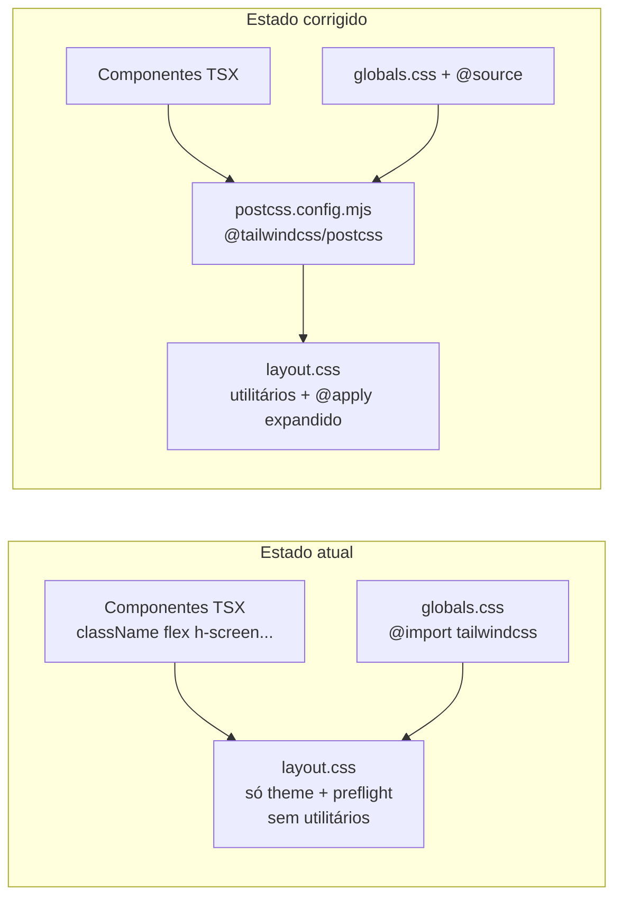

# Plano: Correção do layout quebrado (Mika Web)

## Diagnóstico

### Problema 1 — Causa raiz do layout feio (crítico)

Análise do CSS compilado em [`apps/web/.next/static/css/app/layout.css`](apps/web/.next/static/css/app/layout.css) revela:

- **Nenhuma classe utilitária** (`flex`, `h-screen`, `bg-bg-primary`, `grid`, etc.) foi gerada
- Diretivas **`@apply` não compiladas** permanecem literais no output (linhas 1382–1388), o que o navegador ignora:

```css
body {
  @apply bg-background text-foreground;  /* inválido no browser */
}
```

Sem utilitários, os componentes em [`app-shell.tsx`](apps/web/src/components/layout/app-shell.tsx), [`sidebar.tsx`](apps/web/src/components/layout/sidebar.tsx) e [`ai-hub.tsx`](apps/web/src/components/layout/ai-hub.tsx) renderizam como HTML sem estilo — exatamente o sintoma reportado em **todas as telas**.

**Causa:** o projeto usa Tailwind CSS v4 (`@import "tailwindcss"` em [`globals.css`](apps/web/src/app/globals.css)) e tem `@tailwindcss/postcss` nas dependências, mas **não existe `postcss.config.mjs`** em [`apps/web/`](apps/web/). Sem o plugin PostCSS, o Tailwind não escaneia os arquivos `.tsx` e não gera utilitários nem expande `@apply`.



### Problema 2 — 404 do icon-192.png (secundário)

[`manifest.json`](apps/web/public/manifest.json) referencia `/icon-192.png` e `/icon-512.png`, mas [`apps/web/public/`](apps/web/public/) contém **apenas** `manifest.json`. O 404 aparece no console (confirmado no terminal: `GET /icon-192.png 404`), mas **não causa** quebra visual — é ruído de PWA/manifest.

---

## Correções propostas

### Etapa 1 — Configurar PostCSS (fix principal)

Criar [`apps/web/postcss.config.mjs`](apps/web/postcss.config.mjs):

```js
const config = {
  plugins: {
    '@tailwindcss/postcss': {},
  },
};
export default config;
```

### Etapa 2 — Garantir scan de conteúdo (Tailwind v4)

Adicionar no topo de [`apps/web/src/app/globals.css`](apps/web/src/app/globals.css), após os imports:

```css
@source "../**/*.{ts,tsx}";
```

Isso garante que o Tailwind escaneie todos os componentes em `src/` dentro do monorepo.

### Etapa 3 — Corrigir tipografia Inter

Em [`apps/web/src/app/layout.tsx`](apps/web/src/app/layout.tsx), `body` usa `inter.className` mas [`globals.css`](apps/web/src/app/globals.css) referencia `var(--font-inter)` que nunca é definida.

Ajuste alinhado à [spec visual](docs/VISUAL-DESIGN.md):

```tsx
const inter = Inter({ subsets: ['latin'], variable: '--font-inter' });
// html: className={cn('dark font-sans', inter.variable, geist.variable)}
// body: className={inter.className}
```

### Etapa 4 — Adicionar ícones PWA

Criar em [`apps/web/public/`](apps/web/public/):

- `icon-192.png` (192×192)
- `icon-512.png` (512×512)
- `favicon.ico` (opcional, melhora aba do browser)

Design: esfera gradiente azul→roxo conforme [`mika-avatar.tsx`](apps/web/src/components/ui/mika-avatar.tsx) e paleta `#0B1120` / `#3B82F6` / `#8B5CF6` da spec.

Alternativa rápida: gerar SVG e converter, ou usar script Node com `sharp` se já disponível no projeto.

### Etapa 5 — Ajustes finos de layout mobile (pós-CSS)

Após utilitários funcionarem, validar e corrigir se necessário:

| Arquivo | Ajuste |
|---------|--------|
| [`app-shell.tsx`](apps/web/src/components/layout/app-shell.tsx) | Padding-left no `main` em mobile (`pl-14 md:pl-0`) para não sobrepor botão hamburger |
| [`sidebar.tsx`](apps/web/src/components/layout/sidebar.tsx) | Garantir `md:flex` visível sempre em desktop (sidebar não deve ficar oculta em telas ≥768px) |

Esses ajustes são secundários — só aplicar se ainda houver sobreposição após Etapa 1–2.

### Etapa 6 — Atualizar documentação

Atualizar [`docs/VISUAL-DESIGN.md`](docs/VISUAL-DESIGN.md) seção "Referência rápida para desenvolvedores" com:

- Requisito de `postcss.config.mjs` para Tailwind v4
- Lista de assets PWA obrigatórios em `public/`

---

## Verificação (critérios de aceite)

1. **CSS compilado:** após `pnpm --filter web dev` (ou rebuild), inspecionar `layout.css` e confirmar presença de utilitários (ex.: regras com `display: flex`, `background-color` para tokens Mika)
2. **@apply expandido:** `body` deve ter `background-color: var(--background)` — não `@apply` literal
3. **Visual:** em `http://localhost:3000/` após login:
   - Fundo escuro `#0B1120`
   - Header + Sidebar + Workspace + AI Hub (≥1280px) conforme [docs/VISUAL-DESIGN.md](docs/VISUAL-DESIGN.md)
   - Cards com border-radius 16px e padding 24px
4. **Console limpo:** `GET /icon-192.png` retorna **200**
5. **Responsivo:** mobile com sidebar drawer + FAB da IA; desktop com 3 colunas

---

## Escopo fora deste plano

- Modo claro (spec diz secundário, não implementado)
- Chat inteligente no AI Hub (F06 — placeholder permanece)
- Progresso semanal dinâmico (F04 — valor fixo 78% permanece)
