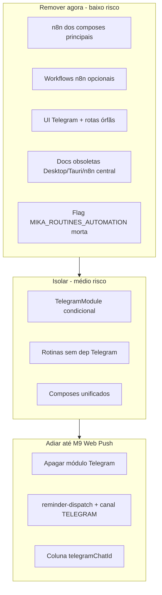

# Plano de remoção de legado — Mika v1.5

## Contexto e princípio

A [AD-016](.specs/project/AD-016-repriorizacao-integracoes-e-roadmap.md) e o [PLAN-V15-VPS-ENXUTA](.specs/project/PLAN-V15-VPS-ENXUTA.md) já **desligaram operacionalmente** Telegram, n8n e lembretes externos via flags no [docker-compose.v1.5.yml](docker/docker-compose.v1.5.yml). O legado ainda **ocupa o repositório**: módulos sempre importados, UI de vinculação Telegram, workflows n8n, composes duplicados e docs desatualizadas.

**Princípio recomendado:** remover o que não volta ao roadmap; **isolar** o que ainda pode servir até M9 (Web Push); **não apagar** entidades adiadas (Finanças, Goals no backend) até a consolidação em Projetos estar completa.



---

## Inventário: o que é legado vs adiado

| Área | Status atual | Ação recomendada |
|------|--------------|------------------|
| **n8n** | Workflows em [docker/n8n/](docker/n8n/workflows/); profile `legacy` nos composes | Mover para compose opcional; remover do caminho principal |
| **Telegram** | [apps/api/src/modules/telegram/](apps/api/src/modules/telegram/); worker [telegram.ts](apps/worker/src/utils/telegram.ts) | Isolar agora; apagar após Web Push |
| **Composes staging** | `staging.yml`, `staging.hostinger.yml` vs `v1.5.yml` | Consolidar deploy em v1.5; Caddy só quando houver domínio |
| **Desktop nativo** | Só menções em docs ([STACK.md](.specs/architecture/STACK.md)) | Limpar documentação |
| **Objetivos (/goals)** | Fora da sidebar; página ainda existe | Redirect para `/projects`; manter API `Goal` |
| **Finanças** | UI redirect; API ativa (AD-013 v2/v3) | Manter backend; não remover |
| **Studies/Insights** | Só redirects web; sem backend | Pode remover rotas após período de compatibilidade |
| **Lembretes Telegram** | Flags `MIKA_REMINDERS_ENABLED=false` | Manter código até canal Web Push existir |
| **Rotinas** | `GET /routines/latest` usado no Dashboard | Manter módulo; desacoplar entrega Telegram |

**Fora do escopo de remoção:** `memory-index`, PostgreSQL/pgvector, Redis, Chat, Projetos, Dashboard, Agenda.

---

## Fase 1 — Infra Docker e runbooks (impacto alto, risco baixo)

**Objetivo:** um único caminho de deploy; legado só via compose explícito.

### Ações

1. **Tornar [docker-compose.v1.5.yml](docker/docker-compose.v1.5.yml) o compose canônico de deploy** e atualizar [README.md](README.md), [docker/README-DEPLOY.md](docker/README-DEPLOY.md) e [AMBIENTE-DE-TESTE-STAGING.md](.specs/project/AMBIENTE-DE-TESTE-STAGING.md) para apontar para ele como padrão.

2. **Criar `docker/docker-compose.legacy.yml`** (ou `docker-compose.n8n.yml`) contendo apenas:
   - serviço `n8n`
   - documentação de como importar workflows de [docker/n8n/workflows/](docker/n8n/workflows/)

3. **Remover n8n** de [docker-compose.yml](docker/docker-compose.yml) e [docker-compose.prod.yml](docker/docker-compose.prod.yml) (hoje já está em profile `legacy`/`n8n` — extrair para arquivo separado e eliminar do compose principal).

4. **Deprecar composes redundantes:**
   - `staging.hostinger.yml` → substituído por v1.5 (mesmas portas 3000/3001)
   - `staging.yml` → manter apenas se Caddy/HTTPS for necessário; documentar como “staging com domínio”
   - Adicionar nota `DEPRECATED` no topo dos arquivos antigos por 1 sprint antes de deletar

5. **Ajustar [docker/.env.staging.example](docker/.env.staging.example):**
   - Remover referências a Telegram como habilitado
   - Remover ou implementar `MIKA_ROUTINES_AUTOMATION_ENABLED` (hoje **não é lida** em nenhum `.ts` — flag morta)

6. **Dev local:** README deve recomendar só infra:
   ```bash
   docker compose -f docker/docker-compose.yml up -d postgres redis
   pnpm dev
   ```
   (sem subir api/web/worker via imagens `mikaassit/*:latest` do compose dev atual)

### Critério de aceite

- `docker compose -f docker/docker-compose.v1.5.yml --env-file .env.staging config` válido
- Nenhum runbook principal menciona n8n como requisito
- `docker stats` na VPS com ≤5 containers (web, api, worker, postgres, redis)

---

## Fase 2 — UI e superfície web órfã (risco baixo)

**Objetivo:** usuário não vê funcionalidades fora do roadmap.

### Ações

1. **Remover seção “Vincular Telegram”** de [apps/web/src/app/(app)/settings/page.tsx](apps/web/src/app/(app)/settings/page.tsx) e endpoints de auth usados só por ela (`POST /auth/telegram/code`) — ou ocultar atrás de env `NEXT_PUBLIC_TELEGRAM_ENABLED` se quiser manter dev legado.

2. **Redirect `/goals` → `/projects`** em [apps/web/src/app/(app)/goals/page.tsx](apps/web/src/app/(app)/goals/page.tsx) (alinhado AD-016: objetivos dentro de projetos).

3. **Manter redirects** de `/finance`, `/studies`, `/insights` por compatibilidade de bookmark (AD-013/014) ou remover após confirmação — baixo impacto.

4. **Remover componentes não usados:** [coming-soon-page.tsx](apps/web/src/components/ui/coming-soon-page.tsx) se confirmado sem referências.

5. **Atualizar README:** encurtar seções “Telegram legado” e “Rotinas n8n” para apêndice opcional ou mover para `docker/README-LEGACY.md`.

### Critério de aceite

- Settings sem Telegram
- Sidebar inalterada (já correta)
- Build web OK

---

## Fase 3 — Desacoplamento da API (risco médio)

**Objetivo:** API v1.5 não carrega nem depende de Telegram no runtime padrão. Corresponde à Fase 2 do [PLAN-V15-VPS-ENXUTA](.specs/project/PLAN-V15-VPS-ENXUTA.md).

### Ações

1. **TelegramModule condicional** em [app.module.ts](apps/api/src/app.module.ts):
   - Usar `DynamicModule` ou factory que só registra `TelegramModule` quando `MIKA_TELEGRAM_MODULE_ENABLED=true`
   - Hoje o módulo importa sempre, mesmo com bot desligado

2. **Desacoplar rotinas:**
   - Remover `RoutinesModule → TelegramModule` em [routines.module.ts](apps/api/src/modules/routines/routines.module.ts)
   - Introduzir interface `RoutineDeliveryPort` com implementações `WebOnlyDelivery` (default) e `TelegramDelivery` (legado)
   - [routines.service.ts](apps/api/src/modules/routines/routines.service.ts): `channel: 'WEB'` em vez de `'TELEGRAM'` quando legado desligado

3. **Lembretes:** já respeitam `MIKA_REMINDERS_ENABLED` em [reminder-scheduler.service.ts](apps/api/src/modules/reminders/reminder-scheduler.service.ts) — validar que com flag off não há jobs na fila.

4. **Smoke v1.5:** atualizar [SMOKE-STAGING.md](.specs/project/SMOKE-STAGING.md) removendo `/telegram/webhook` e crons n8n do checklist principal.

### Critério de aceite

- API sobe com flags default v1.5 sem inicializar bot Grammy
- Dashboard continua exibindo `GET /routines/latest`
- Chat web inalterado

---

## Fase 4 — Worker e pacotes legados (risco médio)

**Objetivo:** worker v1.5 só executa `memory-index` por padrão (já parcialmente feito em [apps/worker/src/index.ts](apps/worker/src/index.ts)).

### Ações

1. Mover para pasta `apps/worker/src/legacy/`:
   - [reminder-dispatch.processor.ts](apps/worker/src/processors/reminder-dispatch.processor.ts)
   - [reminder-dispatcher.service.ts](apps/worker/src/services/reminder-dispatcher.service.ts)
   - [telegram.ts](apps/worker/src/utils/telegram.ts)

2. Documentar reativação apenas com `WORKER_REMINDER_DISPATCH_ENABLED=true` + Web Push futuro.

3. Avaliar remoção de `neglected-tasks` e `neglected-goals` timers se não houver plano de canal web — hoje já off por default.

### Critério de aceite

- Worker log mostra apenas `memory-index` ativo com env v1.5
- Sem erros de conexão Telegram em logs de produção

---

## Fase 5 — Documentação e specs (risco baixo, transversal)

### Arquivos a atualizar

| Arquivo | Mudança |
|---------|---------|
| [STACK.md](.specs/architecture/STACK.md) | Remover “Tauri wrapper opcional” |
| [docs/SPECIFICATION-v1.md](docs/SPECIFICATION-v1.md) | n8n/Telegram como legado, não core |
| [INTEGRATIONS.md](.specs/architecture/INTEGRATIONS.md) | Já atualizado — usar como fonte da verdade |
| [ROADMAP.md](.specs/project/ROADMAP.md) | Marcar F12 Simplificação como In Progress → Done por fase |
| [STATE.md](.specs/project/STATE.md) | Registrar AD de limpeza (AD-017) e fechar todo “Rebaixar Telegram nas docs” |
| Specs F03/F04/F05 | Nota “n8n opcional; disparo manual ou cron interno futuro” |

### Novo documento sugerido

`docker/README-LEGACY.md` — como reativar Telegram + n8n para quem ainda precisar, fora do deploy v1.5.

---

## Fase 6 — Remoção definitiva (bloqueada até M9 Web Push)

**Não executar agora** — pré-requisito: canal `WEB_PUSH` implementado e lembretes funcionando na PWA.

| Item | Motivo do bloqueio |
|------|-------------------|
| Apagar `apps/api/src/modules/telegram/` | Único canal de lembrete/rotina externa hoje |
| Apagar `docker/n8n/` | Sem substituto de cron interno se rotinas automáticas voltarem |
| Migração DB: `User.telegramChatId`, `ReminderChannel.TELEGRAM` | Dados existentes + rollback |
| Apagar `GoalsModule` / `FinanceGoalsModule` | AD-013/016: backend mantido; Goals viram sub-entidade de Project |

Quando M9 estiver pronto, criar spec `MAINT-remocao-telegram` com migração Prisma e período de deprecação de 30 dias.

---

## Ordem de execução recomendada

```text
Sprint 1 (rápido, sem risco de produto)
  Fase 1 + Fase 2 + Fase 5 (docs/runbooks)

Sprint 2 (refatoração interna)
  Fase 3 + Fase 4

Pós-M9
  Fase 6
```

---

## Gates de validação (sem jest)

Conforme [CONVENTIONS.md](.specs/project/CONVENTIONS.md):

1. `pnpm build` — monorepo inteiro
2. `docker compose -f docker/docker-compose.v1.5.yml --env-file .env.staging up -d` + migrate + seed
3. Smoke manual: login, Dashboard, Agenda, Projetos, Chat, `/memories`
4. `docker stats` — RAM idle &lt; 75% na VPS
5. Logs API/worker sem tentativas Telegram por 30 min

---

## Riscos e mitigações

| Risco | Mitigação |
|-------|-----------|
| Dashboard perde resumo diário | Manter `RoutinesModule` + `RoutineRun`; só mudar canal de entrega |
| VPS ainda usa compose antigo | Deprecar com data; script de migração de env |
| Quem usa Telegram perde acesso | Período de aviso + `README-LEGACY` com compose separado |
| Goals órfãos no DB | Redirect UI; API mantida até modelo ProjectGoal |

---

## Entregáveis finais esperados

- Deploy único documentado via `docker-compose.v1.5.yml`
- n8n e Telegram só em compose/README legado
- API e worker sem dependência hard de Telegram no modo default
- UI sem superfícies de integrações fora do roadmap
- Docs alinhadas ao AD-016
- Plano explícito para remoção total pós-Web Push
