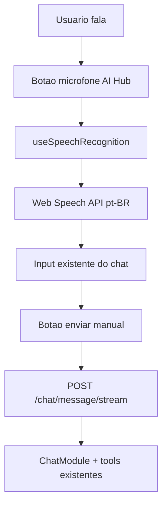

# Plano de Implementação — M7 Entrada por Voz no Chat

## Contexto e posição no projeto

O projeto concluiu **M1–M6** (fundação, memória, rotinas, contexto pessoal, lembretes, chat copiloto). A decisão **AD-015** antecipou entrada por voz como **M7** antes da voz conversacional completa (**M11**), validando padrões de uso reais com custo mínimo.

**Já pronto (Specify + Design + Tasks):**
- [`.specs/features/M7-entrada-voz-chat/spec.md`](.specs/features/M7-entrada-voz-chat/spec.md) — requisitos VOICE-CHAT-01 a 05
- [`.specs/features/M7-entrada-voz-chat/design.md`](.specs/features/M7-entrada-voz-chat/design.md) — arquitetura e estados de UI
- [`.specs/features/M7-entrada-voz-chat/tasks.md`](.specs/features/M7-entrada-voz-chat/tasks.md) — T001–T008

**Pendente:** execução frontend em [`apps/web`](apps/web). Nenhum código de voz existe hoje (grep sem `SpeechRecognition`/`Mic`).

**Ponto de integração atual** — composer do AI Hub em [`apps/web/src/components/layout/ai-hub.tsx`](apps/web/src/components/layout/ai-hub.tsx):

```207:225:apps/web/src/components/layout/ai-hub.tsx
      <div className="border-t border-border p-4">
        {error && <p className="mb-2 text-xs text-destructive">{error}</p>}
        <form className="flex gap-2" onSubmit={...}>
          <Input value={input} onChange={...} placeholder="Conversar com Mika..." ... />
          <Button type="submit" size="icon" ...>
            <Send className="h-4 w-4" />
          </Button>
        </form>
      </div>
```

O fluxo de envio (`handleSend` → `sendMessage` → `chatApi.streamMessage`) em [`chat-context.tsx`](apps/web/src/contexts/chat-context.tsx) e [`api-client.ts`](apps/web/src/lib/api-client.ts) **permanece intocado**.

---

## Arquitetura da solução



**Escopo explícito (fora do M7):** STT backend, TTS, wake word, envio automático (VOICE-CHAT-05 deferred), alterações em API/worker/Prisma.

---

## Ondas de implementação (4 commits atômicos sugeridos)

| Onda | Tasks | Entrega | Gate |
|------|-------|---------|------|
| A | T001 | Hook + tipos TS | `pnpm --filter web build` |
| B | T002 + T003 + T004 | UI microfone + estados + preenchimento input | build + smoke visual local |
| C | T006 | Mensagens de erro pt-BR | build |
| D | T007 + T008 | Docs + checklist UAT preenchido | STATE/ROADMAP sync + UAT Erik |

---

## Onda A — Hook `useSpeechRecognition` (T001)

### Arquivos novos

1. **`apps/web/src/types/speech-recognition.d.ts`**
   - Declarações ambient para `SpeechRecognition`, `SpeechRecognitionEvent`, `webkitSpeechRecognition` (Chrome/Edge exigem prefixo `webkit`).
   - Incluído automaticamente pelo `tsconfig` (`**/*.ts`).

2. **`apps/web/src/hooks/use-speech-recognition.ts`**
   - Padrão alinhado a [`use-media-query.ts`](apps/web/src/hooks/use-media-query.ts): `'use client'`, detecção SSR-safe.

### API pública do hook

```typescript
type SpeechRecognitionErrorCode =
  | 'not-supported'
  | 'permission-denied'
  | 'no-speech'
  | 'network'
  | 'aborted'
  | 'unknown';

type UseSpeechRecognitionReturn = {
  isSupported: boolean;
  isListening: boolean;
  isProcessing: boolean; // entre onend e resultado final aplicado
  interimTranscript: string;
  finalTranscript: string;
  error: SpeechRecognitionErrorCode | null;
  startListening: () => void;
  stopListening: () => void;
  resetTranscript: () => void;
};
```

### Comportamento interno (detalhado)

| Aspecto | Decisão |
|---------|---------|
| Idioma | `recognition.lang = 'pt-BR'` |
| Modo | `continuous: false` — uma utterance por clique (toggle start/stop) |
| Resultados parciais | `interimResults: true` — alimenta `interimTranscript` sem enviar |
| Instância | Criar `SpeechRecognition` no `startListening`; abortar no unmount |
| Toggle | Segundo clique durante escuta chama `stop()` (edge case da spec) |
| Permissão | Erro `not-allowed` → `permission-denied` |
| Sem fala | `no-speech` → input intacto, permitir nova tentativa |
| Suporte | `isSupported = !!(window.SpeechRecognition \|\| window.webkitSpeechRecognition)` |

### Mapa de erros → mensagens pt-BR (usado na UI, T006)

| Código interno | Mensagem ao usuário |
|----------------|---------------------|
| `not-supported` | Reconhecimento de voz não disponível neste navegador. |
| `permission-denied` | Permissão de microfone negada. Libere o microfone nas configurações do navegador. |
| `no-speech` | Não foi possível entender a fala. Tente novamente. |
| `network` | Erro de rede durante o reconhecimento. Tente novamente. |
| `aborted` | (silencioso — parada intencional pelo usuário) |
| `unknown` | Erro ao reconhecer voz. Tente novamente. |

### Commit sugerido

`feat(web): hook useSpeechRecognition para entrada por voz pt-BR`

---

## Onda B — UI no AI Hub (T002, T003, T004)

### Arquivo alterado

[`apps/web/src/components/layout/ai-hub.tsx`](apps/web/src/components/layout/ai-hub.tsx) — apenas `AiHubContent`.

### Layout do composer

```
[ Input flex-1 ] [ Mic btn icon ] [ Send btn icon ]
[ status line opcional: "Ouvindo..." / erro voz ]
```

- Botão microfone **entre** input e enviar (design: "ao lado do botão de enviar").
- Ícones Lucide: `Mic` (idle), `MicOff` ou `Square` (listening — parar), `Loader2` (processing se necessário).
- Variante `outline` ou `ghost` para não competir visualmente com o botão primário de envio.
- `aria-label` e `aria-pressed` em pt-BR: "Iniciar entrada por voz" / "Parar entrada por voz".

### Estados visuais (VOICE-CHAT-03)

| Estado | Condição | Feedback |
|--------|----------|----------|
| Idle | `!isListening && !voiceError` | Mic normal; tooltip "Falar com a Mika" |
| Listening | `isListening` | Botão `destructive` ou accent pulsante (`animate-pulse`); texto abaixo: **Ouvindo...** |
| Processing | `isProcessing` | Texto **Processando áudio...** (breve, entre `onend` e aplicar texto) |
| Unsupported | `!isSupported` | Botão disabled + tooltip explicativo |
| Error | `voiceError` | Linha `text-destructive text-xs` abaixo do form (mesmo padrão do `error` do chat) |

**Tooltip:** usar [`@/components/ui/tooltip`](apps/web/src/components/ui/tooltip.tsx) já presente em `TooltipProvider` global — não há toast/sonner no projeto.

### Integração com `input` (T004)

```typescript
const { isSupported, isListening, interimTranscript, finalTranscript, error: voiceError, ... } =
  useSpeechRecognition();

// Quando finalTranscript muda (useEffect):
//   setInput(prev => prev.trim() ? `${prev.trim()} ${finalTranscript}` : finalTranscript)
//   resetTranscript()

// Durante escuta, valor exibido no Input:
//   displayValue = isListening && interimTranscript
//     ? (input ? `${input} ${interimTranscript}` : interimTranscript)
//     : input
```

**Regras:**
- Envio continua **manual** via botão/form submit (VOICE-CHAT-05 deferred).
- Input editável durante e após transcrição.
- Desabilitar microfone quando `sending || loading` (mesma regra do input).
- Não chamar `sendMessage` automaticamente.

### Responsividade

- Desktop: painel lateral `xl:w-96` — botões `size="icon"` cabem na mesma linha.
- Mobile: Sheet full-width — mesma estrutura `flex gap-2`; testar toque no FAB → Sheet → microfone.

### Commit sugerido

`feat(web): botão de microfone e estados de voz no AI Hub`

---

## Onda C — Tratamento de erros (T006)

Grande parte já coberta no hook + UI. Refinar:

- Limpar `voiceError` ao iniciar nova escuta ou ao digitar manualmente.
- `no-speech` e `network`: não limpar texto já digitado.
- Safari/Firefox: `isSupported === false` → botão disabled desde o primeiro render client-side.

**Nota operacional:** Web Speech API exige **contexto seguro** (`https://` ou `localhost`). Staging Hostinger em HTTP puro pode falhar — validar UAT prioritariamente em **localhost** e **Chrome Android com HTTPS** (ver [AMBIENTE-DE-TESTE-STAGING.md](.specs/project/AMBIENTE-DE-TESTE-STAGING.md)).

### Commit sugerido (opcional, se separado)

`fix(web): mensagens pt-BR para erros de reconhecimento de voz`

---

## Onda D — Documentação e UAT (T007, T008)

### Arquivos a atualizar ao concluir

| Arquivo | Alteração |
|---------|-----------|
| [`.specs/project/STATE.md`](.specs/project/STATE.md) | Marcar todos M7; Current Work → próximo milestone; AD-015 impact done |
| [`.specs/project/ROADMAP.md`](.specs/project/ROADMAP.md) | M7 status: **Done**; F11A checked |
| [`.specs/features/M7-entrada-voz-chat/tasks.md`](.specs/features/M7-entrada-voz-chat/tasks.md) | Checkboxes T001–T008 + traceability VOICE-CHAT-01–04 |
| [`.specs/features/M7-entrada-voz-chat/spec.md`](.specs/features/M7-entrada-voz-chat/spec.md) | Success Criteria checked |

**Não alterar** [`PROJECT.md`](.specs/project/PROJECT.md) salvo menção explícita a M7 na visão — escopo mínimo.

### Checklist UAT manual (T008)

Executar em **Chrome Desktop** e **Chrome Android** (Edge Desktop como smoke opcional):

| # | Cenário | Passos | Resultado esperado | Req |
|---|---------|--------|-------------------|-----|
| 1 | Criar tarefa por voz | Mic → falar *"Mika criar atividade para amanhã às nove horas com prioridade 1 chamada revisar planejamento"* → revisar → enviar | Texto no input; tarefa criada via tool `create_task` | VOICE-CHAT-01 |
| 2 | Consultar tarefas | Falar *"O que eu preciso fazer amanhã?"* → enviar | Resposta com dados reais (`get_tasks` / `get_events`) | VOICE-CHAT-02 |
| 3 | Prioridades | Falar *"Quais são minhas prioridades?"* → enviar | Resposta cruzando P1/P2 + memória (RAG existente) | VOICE-CHAT-02 |
| 4 | Memória contextual | Falar pergunta sobre contexto importado → enviar | `search_memory` acionado conforme chat atual | VOICE-CHAT-02 |
| 5 | Toggle escuta | Clicar mic → falar → clicar mic de novo | Captura para; texto parcial preservado se houver | edge case |
| 6 | Permissão negada | Negar microfone no browser | Mensagem pt-BR de orientação | VOICE-CHAT-04 |
| 7 | Navegador incompatível | Firefox ou simular `!isSupported` | Botão disabled + tooltip | VOICE-CHAT-04 |
| 8 | Regressão chat | Enviar mensagem digitada, sugestões, nova sessão, streaming | Comportamento idêntico ao M6 | — |
| 9 | Mobile Sheet | FAB → AI Hub → voz → enviar | Mesmo fluxo sem overlay bloqueando | LL-001 pattern |

Registrar data, navegador e observações em `tasks.md` seção T008.

### Commit sugerido

`docs(specs): concluir M7 entrada por voz — UAT e STATE`

---

## Rastreabilidade requisito → implementação

| ID | Implementação |
|----|---------------|
| VOICE-CHAT-01 | Mic + pt-BR + preenchimento input + envio manual → tools inalteradas |
| VOICE-CHAT-02 | Mesmo fluxo; validação UAT cenários 2–4 |
| VOICE-CHAT-03 | Estados idle/listening/processing + feedback visual |
| VOICE-CHAT-04 | `isSupported`, mapa de erros, tooltip/linha de erro |
| VOICE-CHAT-05 | **Não implementar** — envio manual only |

---

## Riscos e mitigações

| Risco | Mitigação |
|-------|-----------|
| Chrome usa `webkitSpeechRecognition` | Detecção dual no hook |
| iOS Safari suporte limitado | Fora do alvo MVP; botão disabled + tooltip |
| Staging sem HTTPS | UAT local + documentar dependência HTTPS para produção |
| Transcrição imprecisa em pt-BR | Usuário revisa antes de enviar (by design) |
| Concorrência voz + `sending` | Desabilitar mic durante envio/streaming |
| Memory leak | `recognition.abort()` no cleanup `useEffect` |

---

## Critérios de done do milestone

- [ ] `pnpm --filter web build` OK
- [ ] Zero alterações obrigatórias em `apps/api`, `apps/worker`, Prisma
- [ ] Strings visíveis em pt-BR
- [ ] UAT cenários 1–8 passando em Chrome Desktop + Android
- [ ] Sem regressão no chat inteligente (M6)
- [ ] Specs sincronizadas (T007)

---

## Estimativa

**~1 semana part-time** (alinhado ao ROADMAP): ~4–6h de código + 2–3h UAT multi-dispositivo.

## Sequência de execução recomendada

1. Tipos TS + hook isolado (testar no console do browser se necessário)
2. Integrar no `ai-hub.tsx` com estados visuais
3. Build + smoke local (`pnpm dev` já rodando)
4. UAT Desktop → UAT Android
5. Atualizar specs e STATE
