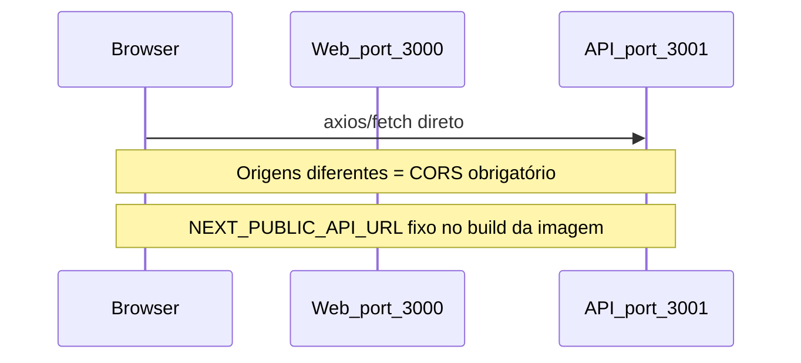
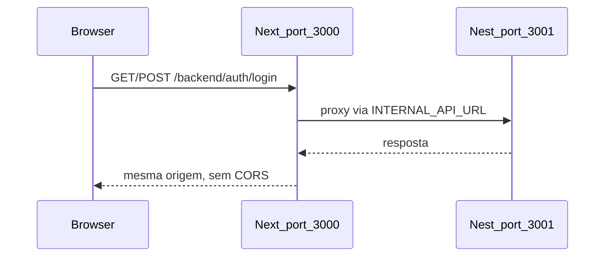
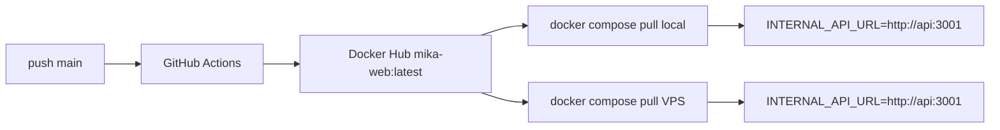

# Plano: proxy same-origin `/backend`

## Problema atual



- [`apps/web/src/lib/api.ts`](apps/web/src/lib/api.ts) e [`apps/web/src/lib/api-client.ts`](apps/web/src/lib/api-client.ts) usam `NEXT_PUBLIC_API_URL` (embutido no build).
- GitHub Actions ([`.github/workflows/deploy.yml`](.github/workflows/deploy.yml)) força um valor no `build-arg`, gerando imagem errada em um dos ambientes.
- CORS em [`apps/api/src/main.ts`](apps/api/src/main.ts) depende de `WEB_URL` / `CORS_EXTRA_ORIGINS` alinhados à URL da barra do navegador.

## Arquitetura alvo



| Ambiente | `INTERNAL_API_URL` (runtime, só servidor) | Browser chama |
|----------|---------------------------------------------|---------------|
| `pnpm dev` local | default `http://localhost:3001` | `/backend/...` |
| Docker Compose | `http://api:3001` | `/backend/...` |
| VPS (pull `latest`) | `http://api:3001` no compose | `/backend/...` |

O browser **nunca** chama a porta 3001 diretamente. Uma imagem `mika-web:latest` serve todos os cenários.

---

## 1. Módulo central de URL da API

Criar [`apps/web/src/lib/api-config.ts`](apps/web/src/lib/api-config.ts):

```typescript
/** Prefixo fixo no bundle — igual em todos os ambientes */
export const API_BASE_PATH = '/backend';

/** URL interna NestJS — só servidor (route handler) */
export function getInternalApiUrl(): string {
  return process.env.INTERNAL_API_URL ?? 'http://localhost:3001';
}
```

---

## 2. Route handler proxy (catch-all)

Criar [`apps/web/src/app/backend/[...path]/route.ts`](apps/web/src/app/backend/[...path]/route.ts) com lógica compartilhada em [`apps/web/src/lib/api-proxy.ts`](apps/web/src/lib/api-proxy.ts).

**Responsabilidades do proxy:**

- Montar URL: `${getInternalApiUrl()}/${path.join('/')}${searchParams}`
- Exportar handlers: `GET`, `POST`, `PUT`, `PATCH`, `DELETE`
- Repassar headers relevantes: `Authorization`, `Content-Type`, `Accept`
- Repassar `body` com streaming (`duplex: 'half'` no Node fetch quando houver body)
- **SSE** (`POST /chat/message/stream`): devolver `upstream.body` sem bufferizar, preservando `Content-Type: text/event-stream`
- **Multipart** (`POST /memory/import`): repassar body bruto com `Content-Type` original (boundary intacto)
- Filtrar headers de resposta hop-by-hop (`transfer-encoding`, `connection`, etc.)

**Limites:** para uploads grandes, avaliar se o default do Next 15 atende; se import de markdown falhar com arquivos grandes, adicionar `export const maxDuration` / config de body conforme necessário (só se reproduzir na validação).

---

## 3. Atualizar cliente HTTP

### [`apps/web/src/lib/api.ts`](apps/web/src/lib/api.ts)

- `baseURL: API_BASE_PATH` (`/backend`)
- Interceptor de refresh: `axios.post(\`${API_BASE_PATH}/auth/refresh\`, ...)`
- Remover `NEXT_PUBLIC_API_URL`

### [`apps/web/src/lib/api-client.ts`](apps/web/src/lib/api-client.ts)

- `streamMessage`: `fetch('/backend/chat/message/stream', ...)` (path relativo)
- Remover `NEXT_PUBLIC_API_URL`
- Upload multipart: manter `FormData`; **remover** header manual `Content-Type: multipart/form-data` (axios deve definir boundary automaticamente — hoje isso pode quebrar o proxy)

---

## 4. Infra Docker e CI

### [`docker/Dockerfile.web`](docker/Dockerfile.web)

- Remover `ARG` / `ENV` de `NEXT_PUBLIC_API_URL`
- Adicionar no stage `runner`: `ENV INTERNAL_API_URL=http://api:3001` como default sensato para Compose

### [`docker/docker-compose.yml`](docker/docker-compose.yml)

- Serviço `web`: trocar `NEXT_PUBLIC_API_URL` por `INTERNAL_API_URL: http://api:3001`
- Remover `NEXT_PUBLIC_API_URL` do serviço `web`

### [`docker/docker-compose.prod.yml`](docker/docker-compose.prod.yml)

- Remover `build.args.NEXT_PUBLIC_API_URL`
- Adicionar `INTERNAL_API_URL=http://api:3001` em `web.environment`

### [`docker/docker-compose.staging.hostinger.yml`](docker/docker-compose.staging.hostinger.yml)

- Adicionar `INTERNAL_API_URL: http://api:3001` no serviço `web`

### [`.github/workflows/deploy.yml`](.github/workflows/deploy.yml)

- Remover bloco `build-args: NEXT_PUBLIC_API_URL=...` do job Build Web

---

## 5. Variáveis de ambiente

### [`.env.example`](.env.example)

- Remover / deprecar `NEXT_PUBLIC_API_URL`
- Adicionar comentário:

```env
# Proxy web → API (runtime, só container/servidor Next)
INTERNAL_API_URL=http://localhost:3001
```

- Manter `WEB_URL` na API (ainda útil para links, Telegram, etc.); CORS deixa de ser gate para o browser

### Dev local sem Docker

- Default `http://localhost:3001` no proxy cobre `pnpm --filter api dev` + `pnpm --filter web dev` sem variável extra
- Se a API rodar fora do Docker mas a web dentro: `INTERNAL_API_URL=http://host.docker.internal:3001` (Windows/Mac)

---

## 6. Documentação operacional (atualização mínima)

Atualizar seções que mandam rebuild com `NEXT_PUBLIC_API_URL`:

- [`docker/README-DEPLOY.md`](docker/README-DEPLOY.md) — uma imagem web universal; `INTERNAL_API_URL` só no compose da VPS
- [`docker/.env.staging.example`](docker/.env.staging.example) — remover `NEXT_PUBLIC_API_URL` / `PUBLIC_API_URL` como requisito de build da web

Não alterar workflows n8n (continuam chamando API direto em `:3001`).

---

## 7. API / CORS (opcional, fora do gate)

Nenhuma mudança obrigatória na API para o fluxo browser funcionar. Opcionalmente, em follow-up, simplificar `resolveCorsOrigins()` em [`apps/api/src/main.ts`](apps/api/src/main.ts) — CORS só importa para clientes externos (Swagger no browser, ferramentas).

---

## Fluxo de deploy pós-correção



Sem `build-arg`, sem IP fixo, sem rebuild por ambiente.

---

## Validação (gate da task)

1. **Build:** `pnpm --filter web build` e `pnpm --filter api build`
2. **Dev local:** API em 3001 + web em 3000 → login em `http://localhost:3000/login` → Network mostra chamadas para `/backend/*`, não `:3001`
3. **Docker:** `docker compose -f docker/docker-compose.yml up -d --build web` (ou pull `latest` após CI) → login funcional
4. **Chat streaming:** enviar mensagem com stream → tokens chegam via `/backend/chat/message/stream`
5. **Import:** upload `.md` em memórias → `/backend/memory/import` retorna sucesso
6. **VPS:** `docker compose pull && up -d` — mesma imagem, sem alterar IP no código

---

## Arquivos tocados (resumo)

| Arquivo | Ação |
|---------|------|
| `apps/web/src/lib/api-config.ts` | criar |
| `apps/web/src/lib/api-proxy.ts` | criar |
| `apps/web/src/app/backend/[...path]/route.ts` | criar |
| `apps/web/src/lib/api.ts` | usar `/backend` |
| `apps/web/src/lib/api-client.ts` | usar `/backend`, fix multipart |
| `docker/Dockerfile.web` | remover build-arg público |
| `docker/docker-compose.yml` | `INTERNAL_API_URL` |
| `docker/docker-compose.prod.yml` | idem |
| `docker/docker-compose.staging.hostinger.yml` | idem |
| `.github/workflows/deploy.yml` | remover build-arg |
| `.env.example`, `docker/README-DEPLOY.md` | docs |
