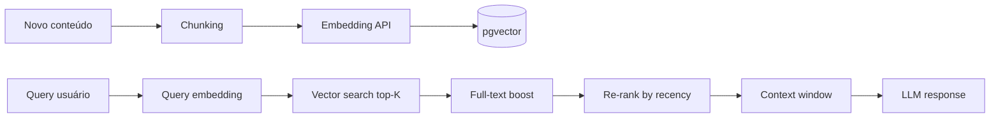

# AI Strategy — Mika

**Status:** Draft  
**Last Updated:** 2026-05-31

---

## Objetivo

Definir como Mika usa IA para ser um copiloto pessoal — não um chatbot genérico — com custo controlado e memória confiável.

---

## Modelos e Uso

| Caso de uso | Modelo | Justificativa |
|-------------|--------|---------------|
| Resumo diário (F03) | GPT-4o-mini | Barato, rotina diária |
| Revisão semanal (F04) | GPT-4o-mini | Volume médio, structured output |
| Chat simples (F06) | GPT-4o-mini | Maioria das interações |
| Decisões complexas | GPT-4o | "Devo priorizar X ou Y?" |
| Embeddings (F02) | text-embedding-3-small | Custo baixo, 1536 dims |
| Check-in meio-dia/noite | GPT-4o-mini | Curto, template-based |

**Regra:** WHEN query classificada como `decision_support` THEN system SHALL usar GPT-4o; ELSE GPT-4o-mini.

---

## Arquitetura de Memória (F02 — M2)



### Chunking

- Markdown: split por heading (##)
- Tasks/Projects: 1 chunk por entidade (title + description)
- Reflections: split por parágrafo, max 500 tokens/chunk
- Overlap: 50 tokens entre chunks adjacentes

### Retrieval (RAG Híbrido)

1. Vector search: top 10 chunks (cosine similarity > 0.7)
2. Full-text PostgreSQL: top 5 (ts_rank)
3. Merge + deduplicate
4. Re-rank: boost recency (decay 30 dias) + lifeArea match
5. Select top 5 para context window

### Context Window Budget

| Componente | Max tokens |
|------------|------------|
| System prompt | 800 |
| Retrieved memory | 2000 |
| Recent chat (5 msgs) | 1500 |
| User query | 500 |
| **Total input** | **~4800** |
| Response max | 1000 |

---

## System Prompt (Base)

```
Você é Mika, assistente pessoal de Erik. Seu papel é copiloto — não secretária.

Princípios:
- Seja direta e prática
- Priorize clareza sobre volume
- Quando houver conflito de prioridades, apresente trade-offs
- Use contexto de memória quando relevante
- Nunca invente compromissos ou datas — consulte dados reais
- Responda em português brasileiro
- Formato: conciso para Telegram, mais detalhado para web
```

---

## Tool Calling (F06)

| Tool | Descrição | Quando usar |
|------|-----------|-------------|
| `get_tasks` | Lista tarefas filtradas | "O que preciso fazer?" |
| `get_events` | Eventos por período | "Compromissos esta semana?" |
| `get_goals` | Objetivos por horizon | "Estou atrasado em alguma meta?" |
| `get_finance_goals` | Metas financeiras | "Situação financeira?" |
| `search_memory` | RAG search | Perguntas contextuais |
| `create_task` | Criar tarefa | "Lembre de..." |
| `create_reflection` | Salvar reflexão | Rotina noturna |

---

## Custo Estimado (Uso Pessoal)

| Operação | Frequência | Tokens/op | Custo/mês |
|----------|------------|-----------|-----------|
| Resumo diário | 30/mês | ~2000 | ~$0.30 |
| Chat | 60 msgs/mês | ~1500 | ~$1.50 |
| Embeddings | 100 chunks/mês | ~500 | ~$0.05 |
| Revisão semanal | 4/mês | ~3000 | ~$0.20 |
| **Total estimado** | | | **~$2–5/mês** |

Pico (uso intenso): ~$15–20/mês.

---

## Fallback e Resiliência

| Cenário | Comportamento |
|---------|---------------|
| OpenAI timeout (>30s) | Retry 1x, depois resposta: "Estou com dificuldade agora, tente em alguns minutos" |
| OpenAI rate limit | Queue no BullMQ, retry exponential backoff |
| Embedding fail | Salvar chunk sem embedding, retry async |
| Context too large | Truncar memory chunks mais antigos |

---

## Cache

| Item | TTL | Storage |
|------|-----|---------|
| Resumo diário do dia | 24h | Redis |
| Embeddings | Permanente | pgvector |
| Respostas frequentes ("prioridades hoje") | 1h | Redis |

---

## Prompts por Rotina

### Manhã (F03)

```
Com base nos dados do usuário, gere um resumo matinal:
1. Top 3 prioridades do dia (tarefas + eventos)
2. Compromissos com horário
3. Pendências atrasadas (se houver)
4. Alerta de objetivo negligenciado (se >7 dias sem interação)
5. Pergunta: "Qual sua prioridade principal hoje?"

Tom: motivador, conciso. Max 300 palavras.
```

### Revisão Semanal (F04)

```
Gere revisão semanal:
1. Concluídos esta semana (celebrar)
2. Atrasados (listar com dias de atraso)
3. Perderam prioridade (sem interação >7 dias)
4. Novos riscos identificados
5. Sugestão de foco para próxima semana

Tom: honesto, construtivo. Max 500 palavras.
```

---

## Futuro

- [ ] Ollama local para rotinas simples (reduzir custo)
- [ ] Fine-tuning em reflexões do usuário (privacidade!)
- [ ] Classificador local para routing mini vs 4o
- [ ] Memória episódica (summarize old sessions)
