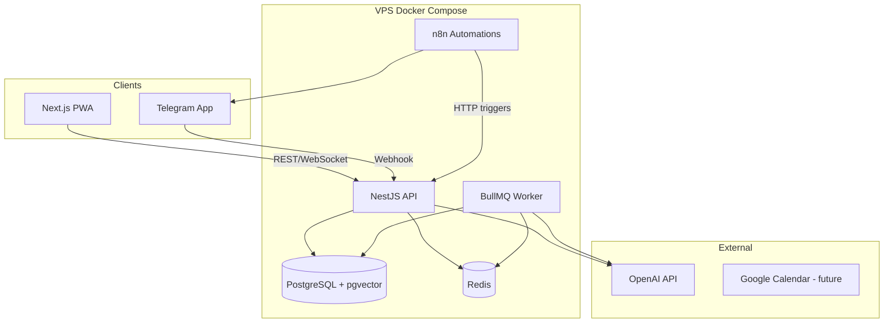
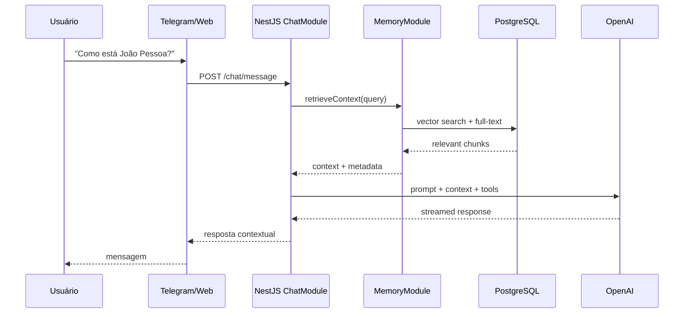
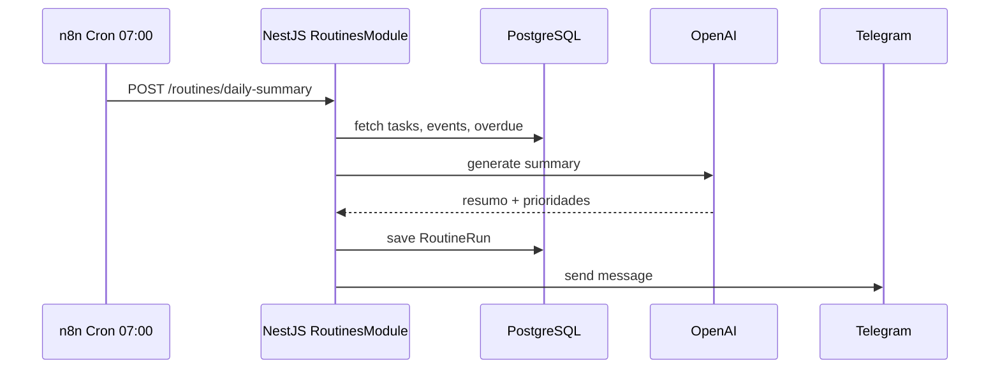

# Architecture — Mika

**Status:** Draft  
**Last Updated:** 2026-05-31

---

## Visão Geral

Mika segue arquitetura **modular monolith** com workers assíncronos, preparada para extração futura de serviços se necessário.

---

## Módulos NestJS (apps/api)

| Módulo | Responsabilidade |
|--------|------------------|
| `AuthModule` | JWT, sessões, magic link (futuro) |
| `UsersModule` | Perfil, preferências, timezone |
| `LifeAreasModule` | Categorias: Profissional, Financeiro, etc. |
| `ProjectsModule` | Projetos e agrupamento |
| `TasksModule` | Tarefas, subtarefas, prioridades |
| `GoalsModule` | Objetivos curto/médio/longo prazo |
| `EventsModule` | Compromissos e calendário interno |
| `ReflectionsModule` | Diário/reflexões |
| `FinanceGoalsModule` | Metas financeiras básicas |
| `MemoryModule` | Chunks, embeddings, RAG (M2) |
| `ChatModule` | Conversas, contexto, tool calling |
| `TelegramModule` | Webhook, comandos, notificações |
| `RemindersModule` | Agendamento de lembretes (M4) |
| `RoutinesModule` | Resumos diários/semanais (M3) |
| `HealthModule` | Health checks |

---

## Fluxo: Chat Inteligente (F06)

---

## Fluxo: Resumo Diário (F03)

---

## Comunicação entre Componentes

| De | Para | Protocolo | Uso |
|----|------|-----------|-----|
| Web | API | HTTPS REST + WS | CRUD, chat streaming |
| Telegram | API | Webhook HTTPS | Mensagens, comandos |
| n8n | API | HTTP internal | Triggers de rotinas |
| API | Worker | Redis/BullMQ | Jobs assíncronos |
| Worker | OpenAI | HTTPS | Embeddings, resumos |
| API | PostgreSQL | TCP | Persistência |

---

## Princípios Arquiteturais

1. **Single user first** — Multi-tenant preparado no schema, não implementado na v1
2. **API-first** — Web e Telegram consomem mesma API
3. **Eventual consistency** — Embeddings e resumos via workers, não síncronos
4. **Fail gracefully** — Se OpenAI indisponível, resposta degradada + retry queue
5. **Self-hosted** — Zero dependência de SaaS crítico (exceto OpenAI)

---

## Escalabilidade Futura

| Estágio | Infra | Trigger |
|---------|-------|---------|
| v1 | Single VPS 4GB | Uso pessoal |
| v2 | VPS 8GB + read replica PG | >1000 memórias vetorizadas |
| v3 | API + Worker em containers separados | Latência chat >5s P95 |
| v4 | Kubernetes ou managed PG | Multi-usuário / SaaS |
