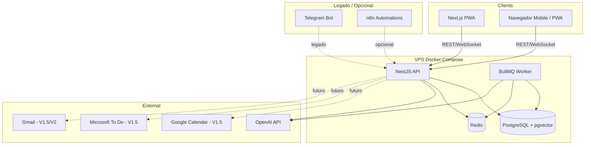
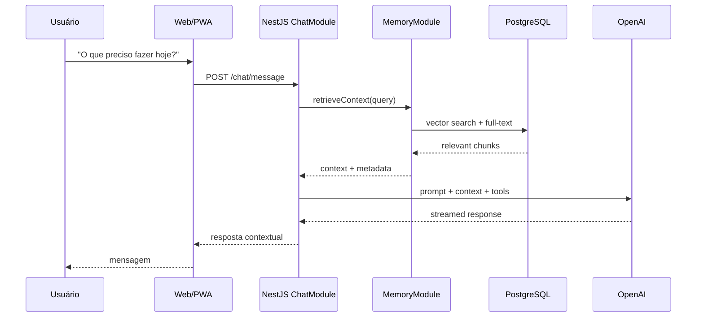
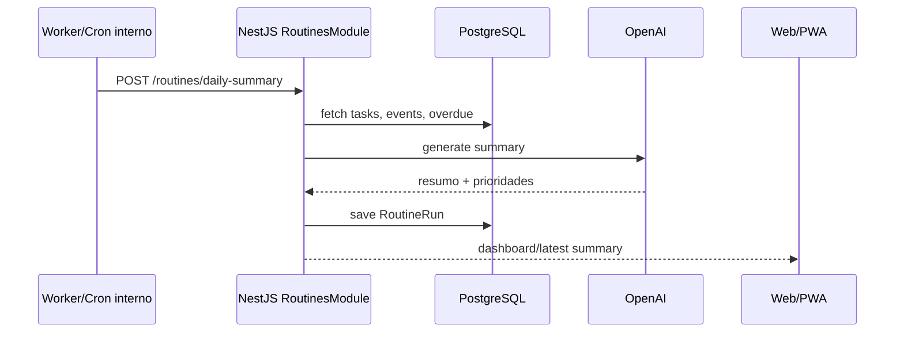

# Architecture — Mika

**Status:** Revisado  
**Last Updated:** 2026-06-12

---

## Visão Geral

Mika segue arquitetura **modular monolith** com workers assíncronos, preparada para extração futura de serviços se necessário.

Após AD-016, a arquitetura principal da V1 considera **Web/PWA** como canal central. Telegram e n8n ficam como legado/opcional, não como dependências obrigatórias para novas features.

---

## Módulos NestJS (apps/api)

| Módulo | Responsabilidade | Status de prioridade |
|--------|------------------|----------------------|
| `AuthModule` | JWT, sessões, magic link futuro | Core |
| `UsersModule` | Perfil, preferências, timezone | Core |
| `LifeAreasModule` | Categorias: Profissional, Financeiro, etc. | Core |
| `ProjectsModule` | Projetos, agrupamento, futuro projeto por prompt/arquivo | Core |
| `TasksModule` | Tarefas, subtarefas, prioridades | Core |
| `GoalsModule` | Objetivos | Compatibilidade; UX consolidada em Projetos |
| `EventsModule` | Compromissos e calendário interno | Core |
| `ReflectionsModule` | Diário/reflexões | Core |
| `FinanceGoalsModule` | Metas financeiras básicas | Backend only / v2 UI |
| `MemoryModule` | Chunks, embeddings, RAG | Core |
| `ChatModule` | Conversas, contexto, tool calling | Core Web/PWA |
| `TelegramModule` | Webhook, comandos, notificações | Legado/opcional |
| `RemindersModule` | Agendamento de lembretes | Core; canal Web/PWA futuro |
| `RoutinesModule` | Resumos diários/semanais | Core; não depender de Telegram |
| `HealthModule` | Health checks | Core |

---

## Fluxo: Chat Inteligente

---

## Fluxo: Resumo Diário

---

## Comunicação entre Componentes

| De | Para | Protocolo | Uso | Prioridade |
|----|------|-----------|-----|------------|
| Web/PWA | API | HTTPS REST + WS/SSE | CRUD, chat streaming, dashboard | Core |
| API | Worker | Redis/BullMQ | Jobs assíncronos | Core |
| Worker | OpenAI | HTTPS | Embeddings, resumos | Core |
| API | PostgreSQL | TCP | Persistência | Core |
| API | Redis | TCP | Filas/cache | Core |
| Telegram | API | Webhook HTTPS | Mensagens/comandos antigos | Legado |
| n8n | API | HTTP internal | Automações complementares | Opcional |

---

## Princípios Arquiteturais

1. **Single user first** — Multi-tenant preparado no schema, não implementado na v1.
2. **Web/PWA first** — canal principal da V1.
3. **Projetos como centro** — objetivos, tarefas, eventos e arquivos devem convergir para Projetos.
4. **Eventual consistency** — embeddings e resumos via workers, não síncronos.
5. **Fail gracefully** — se OpenAI indisponível, resposta degradada + retry queue.
6. **Self-hosted** — zero dependência de SaaS crítico exceto IA.
7. **Integrações por necessidade real** — não adicionar integrações que não sejam usadas no dia a dia.

---

## Escalabilidade Futura

| Estágio | Infra | Trigger |
|---------|-------|---------|
| v1 | Single VPS 4GB | Uso pessoal |
| v1.5 | Single VPS otimizada + integrações agenda/tarefas | Uso diário validado |
| v2 | VPS 8GB + read replica PG | Crescimento de memória/eventos |
| v3 | API + Worker em containers separados | Latência chat >5s P95 |
| v4 | Kubernetes ou managed PG | Multi-usuário / SaaS |
