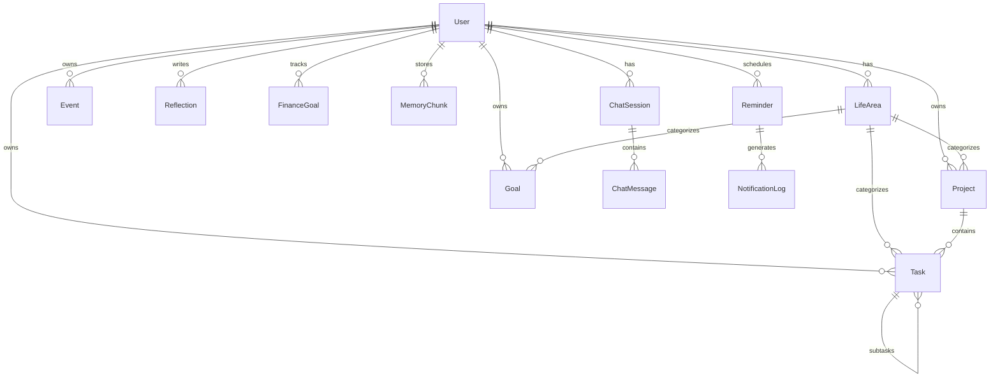

# Data Model — Mika

**Status:** Draft  
**Last Updated:** 2026-05-31

---

## Diagrama ER (Core)



---

## Entidades Core

### User

```typescript
interface User {
  id: string              // uuid
  email: string
  name: string
  timezone: string        // "America/Sao_Paulo"
  telegramChatId?: string
  preferences: Json       // horários rotinas, idioma
  createdAt: Date
  updatedAt: Date
}
```

### LifeArea (Categorias de Memória)

Enum fixo na v1, extensível depois:

| Slug | Label | Exemplos |
|------|-------|----------|
| `professional` | Profissional | Trabalhos, certificações, IA, projetos |
| `financial` | Financeiro | Metas, investimentos, mudança |
| `family` | Familiar | Avó, família, relacionamento |
| `health` | Saúde | Caminhada, academia, terapia |
| `travel` | Viagens | Chile, Santa Catarina, João Pessoa |

```typescript
interface LifeArea {
  id: string
  userId: string
  slug: LifeAreaSlug
  label: string
  color?: string
  icon?: string
}
```

### Project

```typescript
interface Project {
  id: string
  userId: string
  lifeAreaId: string
  title: string
  description?: string
  status: 'active' | 'paused' | 'completed' | 'archived'
  priority: 1 | 2 | 3 | 4 | 5   // 1 = mais alta
  startDate?: Date
  targetDate?: Date
  tags: string[]
  createdAt: Date
  updatedAt: Date
}
```

### Task

```typescript
interface Task {
  id: string
  userId: string
  projectId?: string
  lifeAreaId?: string
  parentTaskId?: string     // subtarefas
  title: string
  description?: string
  status: 'todo' | 'in_progress' | 'done' | 'cancelled'
  priority: 1 | 2 | 3 | 4 | 5
  dueAt?: Date
  completedAt?: Date
  energyLevel?: 'low' | 'medium' | 'high'  // esforço estimado
  contextTags: string[]    // @casa, @trabalho, @celular
  neglectedSince?: Date     // calculado: sem interação > N dias
  createdAt: Date
  updatedAt: Date
}
```

### Goal (Objetivos)

```typescript
interface Goal {
  id: string
  userId: string
  lifeAreaId: string
  title: string
  description?: string
  horizon: 'short' | 'medium' | 'long'  // curto/médio/longo prazo
  status: 'active' | 'achieved' | 'abandoned'
  targetDate?: Date
  progress: number          // 0-100
  createdAt: Date
  updatedAt: Date
}
```

### Event

```typescript
interface Event {
  id: string
  userId: string
  lifeAreaId?: string
  title: string
  description?: string
  startsAt: Date
  endsAt?: Date
  location?: string
  isAllDay: boolean
  externalId?: string       // Google Calendar sync (futuro)
  source: 'manual' | 'google' | 'telegram'
  createdAt: Date
  updatedAt: Date
}
```

### Reflection

```typescript
interface Reflection {
  id: string
  userId: string
  content: string
  energyLevel?: 'low' | 'medium' | 'high'
  mood?: string             // F07 futuro
  routineType?: 'morning' | 'midday' | 'evening' | 'free'
  createdAt: Date
}
```

### FinanceGoal (Metas Financeiras Básicas — F01)

```typescript
interface FinanceGoal {
  id: string
  userId: string
  lifeAreaId: string      // sempre 'financial'
  title: string
  targetAmount: number
  currentAmount: number
  currency: string          // "BRL"
  targetDate?: Date
  status: 'active' | 'achieved' | 'paused'
  createdAt: Date
  updatedAt: Date
}
```

### MemoryChunk (F02 — M2)

```typescript
interface MemoryChunk {
  id: string
  userId: string
  lifeAreaId?: string
  sourceType: 'task' | 'project' | 'goal' | 'reflection' | 'note' | 'import'
  sourceId?: string
  content: string
  embedding: vector(1536)   // pgvector
  metadata: Json            // tags, dates, project refs
  createdAt: Date
  updatedAt: Date
}
```

### ChatSession / ChatMessage (F06)

```typescript
interface ChatSession {
  id: string
  userId: string
  channel: 'web' | 'telegram'
  title?: string
  createdAt: Date
  updatedAt: Date
}

interface ChatMessage {
  id: string
  sessionId: string
  role: 'user' | 'assistant' | 'system'
  content: string
  metadata?: Json           // tokens used, tools called
  createdAt: Date
}
```

### Reminder / NotificationLog (F05)

```typescript
interface Reminder {
  id: string
  userId: string
  entityType: 'task' | 'event' | 'goal' | 'custom'
  entityId?: string
  message: string
  scheduledAt: Date
  channel: 'telegram' | 'web_push' | 'both'
  status: 'pending' | 'sent' | 'failed' | 'cancelled'
  createdAt: Date
}

interface NotificationLog {
  id: string
  reminderId: string
  channel: string
  status: 'sent' | 'failed'
  error?: string
  sentAt: Date
}
```

### RoutineRun (F03/F04)

```typescript
interface RoutineRun {
  id: string
  userId: string
  type: 'daily_summary' | 'weekly_review' | 'midday_check' | 'evening_reflection'
  content: string           // resumo gerado pela IA
  metadata: Json            // stats, items included
  deliveredAt?: Date
  channel: 'telegram' | 'web'
  createdAt: Date
}
```

---

## Índices Recomendados

```sql
-- Tasks
CREATE INDEX idx_tasks_user_status ON tasks(user_id, status);
CREATE INDEX idx_tasks_user_due ON tasks(user_id, due_at) WHERE status != 'done';
CREATE INDEX idx_tasks_neglected ON tasks(user_id, neglected_since);

-- Events
CREATE INDEX idx_events_user_starts ON events(user_id, starts_at);

-- Memory (M2)
CREATE INDEX idx_memory_embedding ON memory_chunks USING ivfflat (embedding vector_cosine_ops);

-- Reminders
CREATE INDEX idx_reminders_scheduled ON reminders(scheduled_at, status) WHERE status = 'pending';
```

---

## Regras de Negócio (Data)

1. **Soft delete** não na v1 — hard delete com confirmação
2. **neglectedSince** recalculado daily via worker: task ativa sem update > 7 dias
3. **Um User** na v1 — schema preparado para multi-user
4. **LifeAreas** seed automático no registro do usuário (5 categorias padrão)
