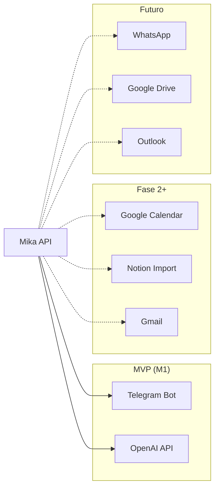

# Integrations — Mika

**Status:** Draft  
**Last Updated:** 2026-05-31

---

## Mapa de Integrações



---

## Prioridade de Integração

| P | Integração | Fase | Complexidade | Valor | Status |
|---|------------|------|--------------|-------|--------|
| P0 | Telegram Bot | M1 | Baixa | Alto | PLANNED |
| P0 | OpenAI API | M1 | Baixa | Alto | PLANNED |
| P1 | Google Calendar | M2 | Média | Alto | PLANNED |
| P2 | Notion (import) | M2 | Média | Médio | PLANNED |
| P2 | Markdown files | M2 | Baixa | Médio | PLANNED |
| P3 | Gmail (eventos) | M3 | Alta | Médio | PLANNED |
| P4 | WhatsApp | M4+ | Alta | Alto | DEFERRED |
| P4 | Google Drive | M4+ | Média | Baixo | DEFERRED |
| P5 | Outlook | M5+ | Alta | Baixo | DEFERRED |

---

## P0: Telegram Bot (M1)

**Biblioteca:** grammY  
**Modo:** Webhook (produção) / Polling (dev)

### Comandos MVP

| Comando | Ação |
|---------|------|
| `/start` | Vincular conta + boas-vindas |
| `/hoje` | Tarefas e eventos do dia |
| `/tarefa [texto]` | Criar tarefa rápida |
| `/prioridades` | Top 5 prioridades |
| `/reflexao [texto]` | Salvar reflexão |
| `/ajuda` | Lista de comandos |

### Mensagens livres

WHEN usuário envia texto livre THEN bot SHALL encaminhar para ChatModule (F06 básico em M1).

### Webhook Setup

```
POST https://api.mika.domain/telegram/webhook
Header: X-Telegram-Bot-Api-Secret-Token: {TELEGRAM_WEBHOOK_SECRET}
```

---

## P0: OpenAI API (M1)

Ver AI-STRATEGY.md para detalhes completos.

**SDK:** Vercel AI SDK (`ai` package)  
**Config:**

```typescript
{
  model: 'gpt-4o-mini',
  temperature: 0.7,
  maxTokens: 1000,
  store: false  // LGPD: não usar para training
}
```

---

## P1: Google Calendar (M2)

**OAuth 2.0** — scope: `calendar.readonly` (v1), `calendar.events` (v2)

### Sync Strategy

- Pull events: cron a cada 15 min via worker
- Map: `externalId = googleEventId`, `source = 'google'`
- Conflict: Google wins (read-only v1)
- Dedup: match por `externalId`

### Endpoints

```
GET  /integrations/google/auth     → OAuth redirect
GET  /integrations/google/callback → Token exchange
POST /integrations/google/sync     → Manual sync trigger
```

---

## P2: Notion Import (M2)

**Abordagem:** Export Markdown → ingestão batch (não sync bidirecional)

1. Usuário exporta workspace Notion como Markdown
2. Upload via web UI ou CLI
3. Parser extrai: pages → Projects/Tasks, databases → structured data
4. Chunking + embedding automático

---

## P2: Markdown Files (M2)

- Upload `.md` via web
- Parse frontmatter (YAML) para metadata
- Chunk por heading
- Associar a LifeArea via tag ou frontmatter `area: financial`

---

## P4: WhatsApp (Deferred)

**Opções avaliadas:**

| Opção | Prós | Contras |
|-------|------|---------|
| Evolution API | Self-hosted, gratuito | Risco ban Meta |
| WhatsApp Business API | Oficial | Custo, burocracia |
| Twilio | Estável | Custo por msg |

**Decisão:** Adiado até M4+. Telegram cobre mobile no MVP.

---

## n8n Workflows (M3)

| Workflow | Trigger | Ação |
|----------|---------|------|
| `daily-summary` | Cron 07:00 | POST /routines/daily-summary → Telegram |
| `midday-check` | Cron 12:30 | POST /routines/midday-check → Telegram |
| `evening-reflection` | Cron 21:00 | POST /routines/evening-reflection → Telegram |
| `weekly-review` | Cron Dom 20:00 | POST /routines/weekly-review → Telegram |
| `health-check` | Cron */5 min | GET /health → alert if fail |

n8n roda no mesmo Docker Compose, acessa API via rede interna.

---

## Fontes de Dados Internas (F01)

| Fonte | M1 | Integração |
|-------|-----|------------|
| Banco de Dados | ✅ CRUD nativo | Prisma |
| Markdown upload | M2 | Parser + ingest |
| PDF | M3+ | pdf-parse + chunk |
| Planilhas CSV | M3+ | Import one-time |
| Notion | M2 | Export → import |

---

## Contratos de Integração

Toda integração externa segue:

1. **Adapter pattern** — `IntegrationAdapter` interface
2. **Retry** — 3 tentativas com exponential backoff
3. **Circuit breaker** — após 5 falhas consecutivas, pausar 15 min
4. **Logging** — status sync, count items, errors (sem conteúdo)
5. **Manual trigger** — endpoint para forçar sync

```typescript
interface IntegrationAdapter {
  name: string;
  connect(credentials: Json): Promise<void>;
  sync(): Promise<SyncResult>;
  disconnect(): Promise<void>;
}

interface SyncResult {
  created: number;
  updated: number;
  errors: string[];
  syncedAt: Date;
}
```
