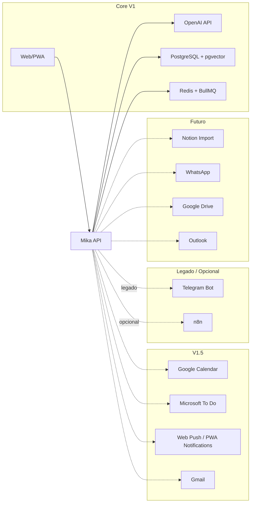

# Integrations — Mika

**Status:** Revisado
**Last Updated:** 2026-06-16

---

## Mapa de Integrações



---

## Prioridade de Integração

| P | Integração | Fase | Complexidade | Valor | Status |
|---|------------|------|--------------|-------|--------|
| P0 | Web/PWA | V1 | Média | Alto | ACTIVE |
| P0 | OpenAI API | V1 | Baixa | Alto | ACTIVE |
| P0 | PostgreSQL + pgvector | V1 | Média | Alto | ACTIVE |
| P0 | Redis + BullMQ | V1 | Média | Alto | ACTIVE para memória, filas e lembretes |
| P1 | Google Calendar | V1.5 | Média | Alto | PLANNED |
| P1 | Microsoft To Do | V1.5 | Média | Alto | PLANNED |
| P1 | Web Push / PWA Notifications | V1.5 | Média | Alto | PLANNED |
| P2 | Gmail | V1.5/V2 | Alta | Médio | PLANNED com consentimento explícito |
| P2 | Upload de arquivos | M8 | Média | Alto | PLANNED para projetos e memória |
| P3 | n8n | Opcional | Baixa | Médio | OPTIONAL |
| Legado | Telegram Bot | Compatibilidade | Baixa | Baixo | LEGACY |
| Deferred | Notion Import | Futuro | Média | Médio | DEFERRED |
| Deferred | WhatsApp | Futuro | Alta | Médio | DEFERRED |
| Deferred | Google Drive | Futuro | Média | Médio | DEFERRED |
| Deferred | Outlook | Futuro | Alta | Baixo | DEFERRED |

---

## Legado: Telegram Bot

Telegram foi o canal inicial da Mika, mas deixou de ser prioridade da V1 após a AD-016. Ele pode permanecer por compatibilidade, desde que novos fluxos não dependam dele.

### Diretrizes

- Não criar novas features prioritárias dependentes de Telegram.
- Não tratar Telegram como canal MVP para lembretes ou chat.
- Manter código existente apenas enquanto não gerar custo operacional relevante.
- Preferir Web/PWA e, futuramente, Web Push para notificações.

### Implementação existente

**Biblioteca:** grammY  
**Modo:** Webhook (produção) / Polling (dev)

### Comandos MVP

| Comando | Ação |
|---------|------|
| `/start` | Vincular conta + boas-vindas |
| `/hoje` | Tarefas e eventos do dia |
| `/tarefa [texto]` | Criar tarefa rápida |
| `/prioridades` | Top 5 prioridades |
| `/reflexao [texto]` | Salvar reflexão |
| `/ajuda` | Lista de comandos |

### Mensagens livres

WHEN usuário envia texto livre THEN bot SHALL encaminhar para ChatModule (F06 básico em M1).

### Webhook Setup

```
POST https://api.mika.domain/telegram/webhook
Header: X-Telegram-Bot-Api-Secret-Token: {TELEGRAM_WEBHOOK_SECRET}
```

---

## P0: OpenAI API

Ver AI-STRATEGY.md para detalhes completos.

**SDK:** Vercel AI SDK (`ai` package)  
**Config:**

```typescript
{
  model: 'gpt-4o-mini',
  temperature: 0.7,
  maxTokens: 1000,
  store: false  // LGPD: não usar para training
}
```

---

## P1: Google Calendar

**OAuth 2.0** — scope: `calendar.readonly` (v1), `calendar.events` (v2)

### Sync Strategy

- Pull events: cron a cada 15 min via worker
- Map: `externalId = googleEventId`, `source = 'google'`
- Conflict: Google wins (read-only v1)
- Dedup: match por `externalId`

### Endpoints

```
GET  /integrations/google/auth     → OAuth redirect
GET  /integrations/google/callback → Token exchange
POST /integrations/google/sync     → Manual sync trigger
```

---

## P1: Microsoft To Do

**Status:** planejado para V1.5.

### Direção

- Ler tarefas externas.
- Criar tarefas após confirmação do usuário.
- Relacionar tarefas externas a projetos Mika.
- Evitar sincronização bidirecional complexa no primeiro incremento.

---

## P1: Web Push / PWA Notifications

**Status:** planejado para substituir Telegram como canal principal de lembretes.

### Casos prioritários

- Lembretes de tarefas.
- Alertas de eventos.
- Resumo diário no app.
- Sugestão de foco do dia.

---

## P2: Upload de arquivos

**Status:** planejado em M8 para Projetos por prompt/arquivo.

### MVP

- `.md`
- `.txt`

### Evolução

- `.pdf`
- `.docx`
- `.csv`

---

## Deferred: Notion Import

**Abordagem:** Export Markdown → ingestão batch (não sync bidirecional)

1. Usuário exporta workspace Notion como Markdown
2. Upload via web UI ou CLI
3. Parser extrai: pages → Projects/Tasks, databases → structured data
4. Chunking + embedding automático

---

## Markdown Files

- Upload `.md` via web
- Parse frontmatter (YAML) para metadata
- Chunk por heading
- Associar a LifeArea via tag ou frontmatter `area: financial`

---

## Deferred: WhatsApp

**Opções avaliadas:**

| Opção | Prós | Contras |
|-------|------|---------|
| Evolution API | Self-hosted, gratuito | Risco ban Meta |
| WhatsApp Business API | Oficial | Custo, burocracia |
| Twilio | Estável | Custo por msg |

**Decisão:** Adiado. A V1 deve validar primeiro Web/PWA, agenda, tarefas, projetos e memória.

---

## n8n Workflows

n8n deixa de ser peça central da V1 por AD-016. Pode continuar como automação complementar, mas rotinas essenciais devem ser desenhadas para funcionar via backend/worker e Web/PWA.

| Workflow | Trigger | Ação |
|----------|---------|------|
| `daily-summary` | Cron 07:00 | POST /routines/daily-summary |
| `midday-check` | Cron 12:30 | POST /routines/midday-check |
| `evening-reflection` | Cron 21:00 | POST /routines/evening-reflection |
| `weekly-review` | Cron Dom 20:00 | POST /routines/weekly-review |
| `health-check` | Cron */5 min | GET /health → alert if fail |

n8n pode rodar no Docker Compose, acessando a API via rede interna, mas não deve ser requisito para o fluxo principal da Mika V1.

---

## Fontes de Dados Internas (F01)

| Fonte | M1 | Integração |
|-------|-----|------------|
| Banco de Dados | ✅ CRUD nativo | Prisma |
| Markdown upload | M2 | Parser + ingest |
| PDF | M3+ | pdf-parse + chunk |
| Planilhas CSV | M3+ | Import one-time |
| Notion | M2 | Export → import |

---

## Contratos de Integração

Toda integração externa segue:

1. **Adapter pattern** — `IntegrationAdapter` interface
2. **Retry** — 3 tentativas com exponential backoff
3. **Circuit breaker** — após 5 falhas consecutivas, pausar 15 min
4. **Logging** — status sync, count items, errors (sem conteúdo)
5. **Manual trigger** — endpoint para forçar sync

```typescript
interface IntegrationAdapter {
  name: string;
  connect(credentials: Json): Promise<void>;
  sync(): Promise<SyncResult>;
  disconnect(): Promise<void>;
}

interface SyncResult {
  created: number;
  updated: number;
  errors: string[];
  syncedAt: Date;
}
```
