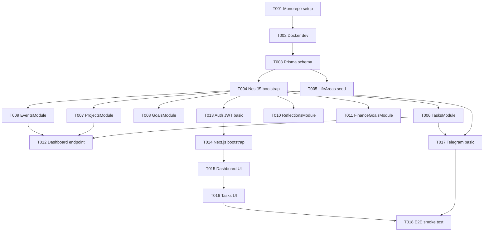

# F01 — Centralização — Tasks

**Spec**: `.specs/features/F01-centralizacao/spec.md`  
**Design**: `.specs/features/F01-centralizacao/design.md`  
**Status**: Ready for execution  
**Total tasks:** 18

---

## Dependency Graph

---

## T001 — Monorepo Setup

**Status:** Pending  
**Requirement IDs:** —  
**Depends on:** —

**What:** Initialize pnpm workspace monorepo with Turborepo, TypeScript configs, and package structure.

**Where:**
- `package.json` (root)
- `pnpm-workspace.yaml`
- `turbo.json`
- `packages/shared/`
- `packages/database/`
- `apps/api/`
- `apps/web/`

**Done when:**
- [ ] `pnpm install` succeeds
- [ ] `pnpm build` compiles all packages
- [ ] Shared package exports types and Zod schemas

**Tests:** `pnpm build` exit 0  
**Gate:** `pnpm build && pnpm lint`

---

## T002 — Docker Dev Environment

**Status:** Pending  
**Requirement IDs:** —  
**Depends on:** T001

**What:** Docker Compose for local development with PostgreSQL 16 (pgvector) and Redis.

**Where:**
- `docker/docker-compose.yml`
- `.env.example`

**Done when:**
- [ ] `docker compose up -d` starts postgres + redis
- [ ] PostgreSQL accessible on localhost:5432
- [ ] Redis accessible on localhost:6379
- [ ] `.env.example` documents all variables

**Tests:** `docker compose ps` shows healthy containers  
**Gate:** `docker compose up -d && docker compose ps`

---

## T003 — Prisma Schema & Migrations

**Status:** Pending  
**Requirement IDs:** CENT-10  
**Depends on:** T002

**What:** Define Prisma schema for User, LifeArea, Task, Project, Goal, Event, Reflection, FinanceGoal. Run initial migration.

**Where:**
- `packages/database/prisma/schema.prisma`
- `packages/database/src/index.ts`

**Done when:**
- [ ] All 8 models defined per DATA-MODEL.md
- [ ] `pnpm prisma migrate dev --name init` succeeds
- [ ] Prisma client generated and exportable from `@mika/database`

**Tests:** `pnpm prisma validate`  
**Gate:** `pnpm prisma migrate dev && pnpm prisma validate`

---

## T004 — NestJS Bootstrap

**Status:** Pending  
**Requirement IDs:** —  
**Depends on:** T003

**What:** NestJS app with Prisma module, config module, health endpoint, global validation pipe.

**Where:**
- `apps/api/src/main.ts`
- `apps/api/src/app.module.ts`
- `apps/api/src/modules/health/`
- `apps/api/src/modules/prisma/`

**Done when:**
- [ ] `pnpm --filter api dev` starts on port 3001
- [ ] GET /health returns `{ status: "ok" }`
- [ ] Zod validation pipe configured globally

**Tests:** `curl localhost:3001/health`  
**Gate:** `pnpm --filter api build && curl -f localhost:3001/health`

---

## T005 — LifeAreas Seed

**Status:** Pending  
**Requirement IDs:** CENT-10  
**Depends on:** T003

**What:** Seed 5 default LifeAreas (professional, financial, family, health, travel) on user creation.

**Where:**
- `apps/api/src/modules/life-areas/`
- `packages/database/prisma/seed.ts`

**Done when:**
- [ ] WHEN user created THEN 5 LifeAreas seeded automatically
- [ ] GET /life-areas returns 5 areas with correct slugs and labels
- [ ] Seed script runnable via `pnpm prisma db seed`

**Tests:** Integration test — create user, verify 5 areas  
**Gate:** `pnpm prisma db seed && curl localhost:3001/life-areas`

---

## T006 — TasksModule CRUD

**Status:** Pending  
**Requirement IDs:** CENT-01, CENT-02  
**Depends on:** T004, T005

**What:** Full CRUD for tasks with priority, dueAt, lifeAreaId, status filtering, complete action.

**Where:**
- `apps/api/src/modules/tasks/`
- `packages/shared/src/schemas/task.schema.ts`

**Done when:**
- [ ] POST /tasks creates task (CENT-01)
- [ ] GET /tasks?status=todo returns filtered, ordered results (CENT-02)
- [ ] PATCH /tasks/:id updates fields
- [ ] POST /tasks/:id/complete sets status DONE + completedAt
- [ ] DELETE /tasks/:id removes task
- [ ] Validation: empty title → 400

**Tests:** Unit tests for service + e2e for endpoints  
**Gate:** `pnpm --filter api test -- --testPathPattern=tasks`

---

## T007 — ProjectsModule CRUD

**Status:** Pending  
**Requirement IDs:** CENT-03, CENT-04  
**Depends on:** T004, T005

**What:** CRUD for projects with progress calculation (completed tasks / total tasks).

**Where:**
- `apps/api/src/modules/projects/`
- `packages/shared/src/schemas/project.schema.ts`

**Done when:**
- [ ] POST /projects creates project (CENT-03)
- [ ] GET /projects/:id returns project with taskCount and completionPercentage (CENT-04)
- [ ] Tasks linkable via projectId
- [ ] Status transitions: active → paused → completed → archived

**Tests:** Create project + 3 tasks, complete 1, verify 33%  
**Gate:** `pnpm --filter api test -- --testPathPattern=projects`

---

## T008 — GoalsModule CRUD

**Status:** Pending  
**Requirement IDs:** CENT-05  
**Depends on:** T004, T005

**What:** CRUD for goals with horizon (short/medium/long), progress 0-100, overdue flag.

**Where:**
- `apps/api/src/modules/goals/`

**Done when:**
- [ ] POST /goals with horizon persists correctly (CENT-05)
- [ ] GET /goals?horizon=long filters correctly
- [ ] Overdue flag when targetDate past and progress < 100

**Tests:** Integration test for overdue detection  
**Gate:** `pnpm --filter api test -- --testPathPattern=goals`

---

## T009 — EventsModule CRUD

**Status:** Pending  
**Requirement IDs:** CENT-06  
**Depends on:** T004

**What:** CRUD for events with date range queries, all-day support, timezone-aware.

**Where:**
- `apps/api/src/modules/events/`

**Done when:**
- [ ] POST /events with startsAt persists (CENT-06)
- [ ] GET /events?from=X&to=Y returns events in range
- [ ] isAllDay events handled correctly
- [ ] Today's events query respects user timezone

**Tests:** Create event tomorrow, query today — should not appear  
**Gate:** `pnpm --filter api test -- --testPathPattern=events`

---

## T010 — ReflectionsModule (Encrypted)

**Status:** Pending  
**Requirement IDs:** CENT-07  
**Depends on:** T004

**What:** CRUD for reflections with AES-256 encryption at-rest for content field.

**Where:**
- `apps/api/src/modules/reflections/`
- `apps/api/src/common/encryption.service.ts`

**Done when:**
- [ ] POST /reflections saves encrypted content in DB (CENT-07)
- [ ] GET /reflections/:id returns decrypted content
- [ ] energyLevel and routineType persisted
- [ ] Raw DB query shows encrypted content (not plaintext)

**Tests:** Verify encryption in DB  
**Gate:** `pnpm --filter api test -- --testPathPattern=reflections`

---

## T011 — FinanceGoalsModule (Encrypted)

**Status:** Pending  
**Requirement IDs:** CENT-08  
**Depends on:** T004, T010

**What:** CRUD for financial goals with encrypted amounts, progress calculation.

**Where:**
- `apps/api/src/modules/finance-goals/`

**Done when:**
- [ ] POST /finance-goals with targetAmount/currentAmount (CENT-08)
- [ ] GET returns progress percentage
- [ ] Amounts encrypted at-rest

**Tests:** Target 50000, current 20000 → 40%  
**Gate:** `pnpm --filter api test -- --testPathPattern=finance`

---

## T012 — Dashboard Endpoint

**Status:** Pending  
**Requirement IDs:** CENT-01, CENT-06  
**Depends on:** T006, T007, T009

**What:** Aggregated GET /dashboard/today — today's tasks (by priority), events, overdue count.

**Where:**
- `apps/api/src/modules/dashboard/`

**Done when:**
- [ ] Returns today's tasks ordered by priority ASC, dueAt ASC
- [ ] Returns today's events ordered by startsAt ASC
- [ ] Includes overdueTasks count
- [ ] Respects user timezone

**Tests:** Seed data, verify aggregation  
**Gate:** `pnpm --filter api test -- --testPathPattern=dashboard`

---

## T013 — Auth JWT Basic

**Status:** Pending  
**Requirement IDs:** —  
**Depends on:** T004

**What:** JWT auth with single user (hardcoded seed). Access token 15min, refresh 7d. Guard on all endpoints except /health.

**Where:**
- `apps/api/src/modules/auth/`

**Done when:**
- [ ] POST /auth/login returns JWT (single user MVP)
- [ ] Protected endpoints return 401 without token
- [ ] Token refresh works

**Tests:** Auth e2e test  
**Gate:** `pnpm --filter api test -- --testPathPattern=auth`

---

## T014 — Next.js Bootstrap

**Status:** Pending  
**Requirement IDs:** —  
**Depends on:** T001, T013

**What:** Next.js 15 app with Tailwind, shadcn/ui, API client, auth context, PWA manifest.

**Where:**
- `apps/web/`

**Done when:**
- [ ] `pnpm --filter web dev` starts on port 3000
- [ ] Tailwind + shadcn/ui configured
- [ ] API client with auth headers
- [ ] PWA manifest.json present
- [ ] Responsive layout shell (sidebar + mobile nav)

**Tests:** `pnpm --filter web build` exit 0  
**Gate:** `pnpm --filter web build`

---

## T015 — Dashboard UI

**Status:** Pending  
**Requirement IDs:** CENT-09  
**Depends on:** T012, T014

**What:** Dashboard page showing today's tasks, events, overdue alerts. Empty state when no data.

**Where:**
- `apps/web/src/app/page.tsx`
- `apps/web/src/components/dashboard/`

**Done when:**
- [ ] Dashboard shows today's tasks and events (CENT-09)
- [ ] Overdue items highlighted
- [ ] Empty state with "Crie sua primeira tarefa" prompt
- [ ] Responsive on mobile (<768px)

**Tests:** Visual verification  
**Gate:** Manual — open localhost:3000, verify dashboard

---

## T016 — Tasks UI (CRUD)

**Status:** Pending  
**Requirement IDs:** CENT-09  
**Depends on:** T006, T015

**What:** Task list page with create/edit form, status toggle, priority badges, life area selector.

**Where:**
- `apps/web/src/app/tasks/`
- `apps/web/src/components/tasks/`

**Done when:**
- [ ] List tasks with filters (status, priority, lifeArea)
- [ ] Create task via form dialog
- [ ] Edit task inline or modal
- [ ] Mark complete with one click
- [ ] Mobile-friendly layout

**Tests:** Create task via UI, verify in list  
**Gate:** Manual — CRUD flow via browser

---

## T017 — Telegram Bot Basic

**Status:** Pending  
**Requirement IDs:** —  
**Depends on:** T006, T009, T012

**What:** Telegram bot with commands: /start, /hoje, /tarefa, /prioridades, /ajuda. Free text routed to placeholder.

**Where:**
- `apps/api/src/modules/telegram/`

**Done when:**
- [ ] /start sends welcome + links account
- [ ] /hoje returns today's tasks and events from dashboard endpoint
- [ ] /tarefa [texto] creates task
- [ ] /prioridades returns top 5 by priority
- [ ] Webhook configured (prod) / polling (dev)

**Tests:** Send commands to bot, verify responses  
**Gate:** Manual — test all commands via Telegram

---

## T018 — E2E Smoke Test

**Status:** Pending  
**Requirement IDs:** CENT-01 through CENT-09  
**Depends on:** T016, T017

**What:** End-to-end verification of F01 complete flow: create data via web, query via Telegram, verify dashboard.

**Where:**
- `apps/api/test/e2e/f01-smoke.e2e-spec.ts`

**Done when:**
- [ ] Create project "João Pessoa" via API
- [ ] Add 3 tasks to project
- [ ] Create event for tomorrow
- [ ] Create finance goal
- [ ] Dashboard returns correct aggregation
- [ ] Telegram /hoje reflects created data
- [ ] All CENT-01 through CENT-09 requirements verified

**Tests:** Full e2e suite pass  
**Gate:** `pnpm --filter api test:e2e -- --testPathPattern=f01-smoke`

---

## Execution Order (Recommended)

| Sprint | Tasks | Duration est. |
|--------|-------|---------------|
| **Sprint 1** | T001 → T002 → T003 → T004 → T005 | ~1 semana |
| **Sprint 2** | T006 → T007 → T008 → T009 | ~1 semana |
| **Sprint 3** | T010 → T011 → T012 → T013 | ~3-4 dias |
| **Sprint 4** | T014 → T015 → T016 | ~1 semana |
| **Sprint 5** | T017 → T018 | ~3-4 dias |

**Total estimado:** 4-5 semanas part-time

---

## Traceability Update

| Requirement ID | Task(s) | Status |
|----------------|---------|--------|
| CENT-01 | T006, T012 | Pending |
| CENT-02 | T006 | Pending |
| CENT-03 | T007 | Pending |
| CENT-04 | T007 | Pending |
| CENT-05 | T008 | Pending |
| CENT-06 | T009, T012 | Pending |
| CENT-07 | T010 | Pending |
| CENT-08 | T011 | Pending |
| CENT-09 | T015, T016 | Pending |
| CENT-10 | T005 | Pending |

**Coverage:** 10 total, 10 mapped to tasks, 0 unmapped ✅
