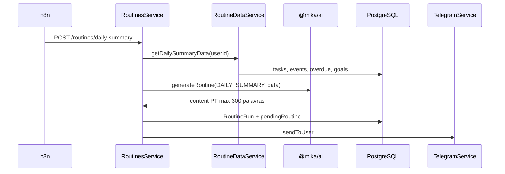

# F03 — Resumo Diário — Design

**Status:** Approved  
**Last Updated:** 2026-05-31

## Decisões técnicas

| Decisão | Escolha | Motivo |
|---------|---------|--------|
| Trigger | n8n cron → POST API | INTEGRATIONS.md; BullMQ só para retry futuro |
| Auth interna | Header `X-Routine-Key` | Bypass JWT; guard dedicado |
| Single-user v1 | userId opcional no body | Primeiro user com telegramChatId |
| Fallback AI | Template estático | Spec edge case OpenAI down |
| pendingRoutine | JSON em User.preferences | TTL morning até 10:00 |
| Midday/Evening | Mesmo módulo, prompts curtos | Roadmap; sem spec separada |

## Fluxo de dados



## DTOs

```typescript
// Trigger (POST body)
{ userId?: string }

// Response
{ routineRunId: string; delivered: boolean; status: 'success' | 'fallback' }

// GET /routines/latest?type=DAILY_SUMMARY
{ id, content, createdAt, metadata } | null
```

## Agregação (RoutineDataService)

- Top 3 tarefas: hoje + atrasadas, orderBy priority asc
- Eventos do dia com horário
- Lista atrasadas com dias de atraso (⚠️ no output)
- Goals ACTIVE sem update >7 dias (alerta leve)

## Midday / Evening (escopo mínimo)

| Rotina | Horário | Pergunta | routineType |
|--------|---------|----------|-------------|
| midday-check | 12:30 | Como está o progresso até agora? | MIDDAY |
| evening-reflection | 21:00 | Como foi seu dia? O que aprendeu? | EVENING |

Midday referencia Reflection `MORNING` do dia (se existir).

## Fallback template

Lista markdown sem prosa: tarefas, eventos, atrasadas numeradas + pergunta de prioridade.
