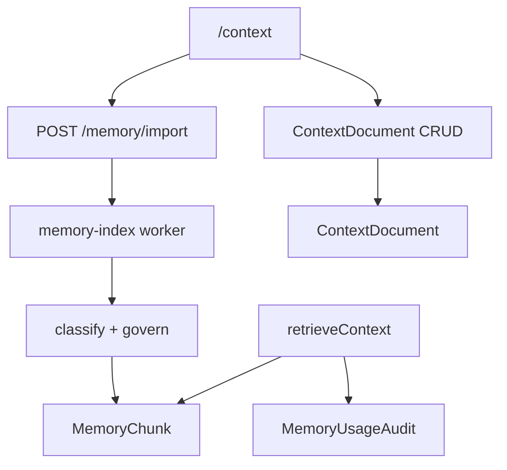

# M4 — Contexto Pessoal — Design

**Status:** Approved  
**Last Updated:** 2026-05-31

> **Convenções:** [CONVENTIONS.md](../../project/CONVENTIONS.md) — sem testes unit como gate; UI e mensagens em pt-BR.

## Decisões técnicas

| Decisão | Escolha | Motivo |
|---------|---------|--------|
| Entidade documento | `ContextDocument` + `ContextDocumentVersion` | GOV versionamento; reimport não perde histórico |
| Camadas memória | Enum `MemoryType` em chunk + documento | PCE 3 camadas; filtro SQL na retrieval |
| Classificação | Heurística frontmatter → LLM opcional | Custo; `CLASSIFY_WITH_LLM=true` |
| Confidence import | IMPORT→FACT 1.0; LLM→INFERRED 0.6 | MEMORY_GOVERNANCE.md |
| Threshold SENSITIVE | 0.75 vs base 0.65 | M4-R06 |
| Audit | `MemoryUsageAudit` pós-montagem contexto | M4-R07 |
| UI route | `/context`; `/memories` 308 redirect | Decisão usuário |
| PDF/DOCX | Stub | Fora escopo M4 |

## Schema Prisma

Novos enums (espelhados em `@mika/shared`):

- `MemoryType`: FIXED | EVOLUTIVE | SENSITIVE
- `PrivacyLevel`: PUBLIC | PRIVATE | SENSITIVE
- `ContextCategory`: LIFE | WORK | FINANCE | PROJECT | ROUTINE | LEARNING | RELATIONSHIP | HEALTH | EMOTIONAL | MEMORY | CUSTOM
- `ConfidenceType`: FACT | INFERRED | HYPOTHESIS
- `RetentionType`: PERMANENT | LONG_TERM | SHORT_TERM | ARCHIVED
- `MemoryAuditChannel`: CHAT | TELEGRAM | ROUTINE

Novos modelos: `ContextDocument`, `ContextDocumentVersion`, `MemoryUsageAudit`.

`MemoryChunk` estendido: `documentId?`, `memoryType`, `privacyLevel`, `importance` (1–5), `confidenceType`, `confidenceScore`, `enabledForRag`, `retentionType`, `archivedAt`.

Migration backfill: chunks legados → `memoryType=EVOLUTIVE`, `privacyLevel=PRIVATE`, `enabledForRag=true`.

## API (`apps/api/src/modules/memory/`)

| Endpoint | Ação |
|----------|------|
| GET/POST/PATCH/DELETE `/context/documents` | CRUD documentos |
| GET `/context/documents/:id/versions` | Histórico |
| POST `/context/documents/:id/reimport` | Nova versão + reindex |
| PATCH/DELETE `/memory/chunks/:id` | Override / remoção |
| GET `/memory/health` | Dashboard métricas |
| GET `/memory/audit` | Log paginado |
| POST `/memory/import` | Aceita `documentId` ou cria documento |

## Pipeline worker

`memory-index.processor` → parse → classify → chunk → embed → upsert com campos de governança.

## Retrieval

1. `detectIntent(message)` — estender `packages/ai/src/intent.ts`
2. `buildRetrievalFilters(intent)` — categorias + memoryTypes
3. `hybridSearch` com filtros SQL + boost `importance`
4. SENSITIVE: min score 0.75; excluir `enabledForRag=false`
5. Injetar até 2 chunks FIXED alta importância no system prompt
6. `auditSensitiveUsage()` após montar contexto

## UI (`apps/web`)

- `apps/web/src/app/(app)/context/page.tsx` — abas Documentos / Chunks / Saúde / Auditoria
- Componentes: `ContextDocumentList`, `DocumentImportForm`, `ChunkGovernancePanel`, `MemoryHealthCard`, `AuditLogTable`
- Sidebar: "Contexto" → `/context`
- `memories/page.tsx` → redirect 308

## Fluxo

