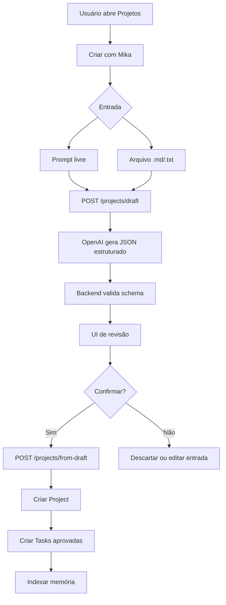

# Design — M8 Projetos por Prompt/Arquivo

**Status:** Draft
**Criado em:** 2026-06-16

---

## Visão Geral

O fluxo de Projetos Inteligentes deve ser implementado como uma camada de rascunho antes do CRUD existente de Projetos. A IA gera uma proposta estruturada, o usuário revisa e somente depois o backend persiste os itens aprovados.



---

## Componentes

### Web

- `ProjectsPage`
  - Mantém lista atual.
  - Adiciona ação "Criar com Mika".
- `ProjectAiDraftModal`
  - Entrada por prompt.
  - Upload de arquivo.
  - Estado de geração.
  - Tratamento de erro.
- `ProjectDraftReview`
  - Revisão do projeto.
  - Revisão de tarefas.
  - Revisão de marcos e eventos sugeridos.
  - Botão de confirmação.

### API

- `ProjectsController`
  - `POST /projects/draft`
  - `POST /projects/from-draft`
- `ProjectsService`
  - Orquestra criação do rascunho.
  - Valida dados estruturados.
  - Persiste projeto e tarefas aprovadas.
- `ProjectDraftAiService`
  - Monta prompt do modelo.
  - Chama OpenAI.
  - Retorna JSON validado.

### Shared

- `CreateProjectDraftSchema`
- `ProjectDraftSchema`
- `CreateProjectFromDraftSchema`

---

## Contratos

### Criar rascunho

`POST /projects/draft`

```json
{
  "prompt": "Quero organizar minha mudança para João Pessoa em novembro.",
  "file": {
    "name": "mudanca.md",
    "content": "# Mudança\n..."
  }
}
```

### Confirmar rascunho

`POST /projects/from-draft`

```json
{
  "project": {
    "title": "Mudança para João Pessoa",
    "description": "Plano para organizar a mudança familiar.",
    "lifeAreaId": "uuid",
    "priority": 2,
    "status": "active",
    "targetDate": "2026-11-01",
    "tags": ["mudanca"]
  },
  "tasks": [
    {
      "title": "Listar móveis que serão levados",
      "priority": 2,
      "dueAt": "2026-07-01"
    }
  ]
}
```

---

## Prompt de IA

O prompt do sistema deve orientar a Mika a:

- responder apenas em JSON válido;
- criar planos práticos e enxutos;
- usar pt-BR;
- não inventar datas exatas quando o usuário não indicar;
- separar inferências em `warnings`;
- priorizar tarefas acionáveis;
- limitar quantidade inicial de tarefas para evitar ruído.

---

## Validação

O backend deve validar a resposta do modelo com Zod antes de retornar para a UI. Se a resposta não for válida:

1. tentar uma reparação simples uma única vez;
2. se ainda falhar, retornar erro amigável;
3. registrar log técnico sem conteúdo sensível desnecessário.

---

## Persistência

### MVP

- Persistir `Project`.
- Persistir `Task[]` aprovadas com `projectId`.
- Enfileirar indexação de memória do projeto e tarefas pelos fluxos existentes.

### Futuro

- Persistir marcos em entidade própria.
- Associar eventos diretamente a projetos.
- Guardar arquivo de origem com metadados.
- Criar lembretes Web Push.

---

## UX

- A criação manual continua visível.
- A criação por IA deve ser uma opção adicional, não substituir o formulário atual.
- Em mobile, o modal deve usar layout vertical com revisão em blocos.
- Nenhum item sugerido deve ser salvo sem confirmação.
- Campos obrigatórios ausentes devem ser destacados antes da confirmação.

---

## Segurança e Privacidade

- Limitar tamanho do conteúdo enviado ao modelo.
- Não enviar arquivos binários no MVP.
- Mostrar erro claro para formato não suportado.
- Evitar logs com conteúdo completo do arquivo/prompt.
- Preservar o padrão atual de autenticação JWT.
